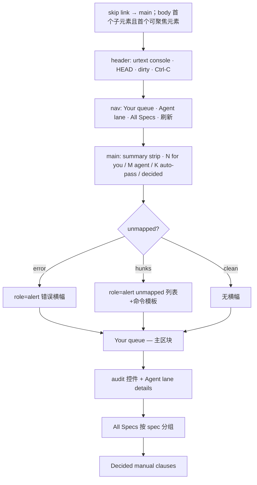
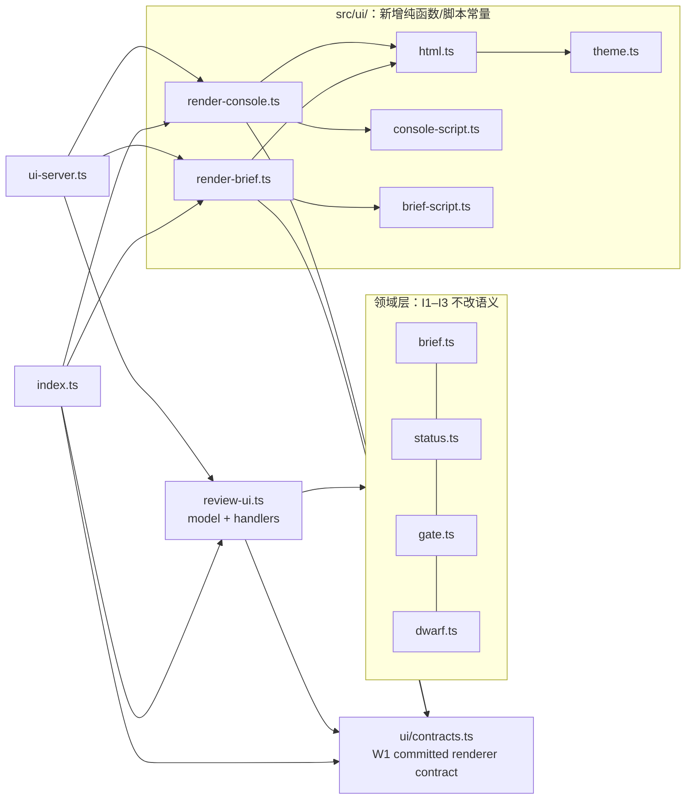

# Urtext Web UI 重设计方案（urtext-20260724-ui-redesign）

- 作者：Claude Fable 5（principal product designer & frontend architect）
- 日期：2026-07-24
- 性质：决策完备提案（planning only）；落地前须过 plan-approval gate
- 修订：已吸收 GPT-5.6-sol 六轮 adversarial review 的全部阻塞项；本版保留原始产品目标、IA、设计方向与三级认知分析，并补齐 async agent transport 内部贯通隔离、仅使用权威 cmux-browser 命令的 actual-action smoke、可重算 DOM↔AX 关联、Chrome CDP 单向职责、merge/evidence coordinator 与 B0/B1/M2/B2/BF immutable exact-SHA 证据、B2 后修复所有权、Node ≥22 stub floor、无动态包安装门、仅公开 `.` 的 package exports、外置脱敏 raw evidence、版本化全分支 contrast fixture matrix、真实 delayed-stub disabled state、byte-accurate body cap、精确 JSON media-type 解析和完整 installed-package public value/type/server compatibility consumer
- 第七轮修订：闭合 GPT-5.6-sol P1–P5 终局反对项——P1 acceptance-only TypeScript 全部编译到 external run-root `ACC_BUILD` outDir（禁止 `dist/` 或任何 package 路径，package-content gate 证明零 acceptance 产物）；P2 evidence manifest 非自指化（payload inventory 排除 manifest 及其 hash/signature sidecars，独立 `manifest.sha256` digest 文件对 finalized manifest bytes 计算，并定义完整重算流程）；P3 BF 验证前后全 branch/ref 名称与 OID 快照断言（无新 descendant、无 unexpected ref、BF commit/tree 不变、S5/coordinator refs 停留在记录 OID）；P4 MEC lease 升级为 repository-global、与 run-id 无关的单一固定外部锁（canonical repo realpath hash key、owner PID/start time/nonce、原子独占创建、liveness/stale recovery、release proof）；P5 澄清不变量为“无动态包安装”而非“无全局可执行”——Node/Git/Bun/cmux/Chrome 为 preflight 记录 absolute realpath/version 的 approved preinstalled platform tools，npm-based 工具必须 repository-local 或 `npx --no-install`，Bun workflow build 保留并 pin observed version，missing/changed 工具 fail-closed
- 证据基线：全量阅读 `src/review-ui.ts`、`src/ui-server.ts`、`src/brief.ts`、`src/status.ts`、`src/gate.ts`、`src/cli.ts` UI 接线、`src/index.ts` 公共 barrel、`src/audit-runner.ts`/`src/oracle-runner.ts`、4 个 UI 测试文件、`specs/urtext/spec.md`/`tasks.md`、docs/{VISION,DESIGN,ROADMAP}.md、英中双语 command reference、上轮计划/审查/实施注记；基线 `npm run check` 通过、4 个 UI 测试文件 39/39 通过；当前开发目录实测 console + C019 详情页含 5 个真实 Blame Diff，但该 `.urtext` 状态被忽略，不能作为隔离 worktree 验收前置
- **仓库信任前置**：本 pipeline 只允许在仓库 owner 明确声明 `trusted checkout` 后执行。信任声明与理由必须先写入 B0 证据记录；缺失或为 untrusted 时，目标立即进入 `paused(trust_required)`，在定义隔离 sandbox/远端执行协议前禁止运行 Git、npm/build/test、Vitest、oracle、fixture、browser 或任何其他 repository-controlled command，仅允许只读审查计划与源码。

## 1. 现状审计（基于证据）

**功能事实（全部实测确认，必须逐一保留）：**

| 能力 | 位置 | 证据 |
|---|---|---|
| 双车道队列（human/agent）+ decide 按钮 | `renderPage` (review-ui.ts:129-216) | 实测 4 human / 40 agent |
| All Specs 全量浏览（44 clauses，2 specs） | review-ui.ts:141-148 | `data-clause` 行 + brief 链接 |
| workspace unmapped 横幅（三态：有/无/检测失败） | review-ui.ts:158-165 | `data-banner="unmapped|unmapped-error"` |
| 风险/证据/stale/依赖状态 | `impactSummary` (review-ui.ts:477-507) | `data-state="risk-*|fresh|stale|no-evidence|dependent-*"` |
| 真实 mapping-scoped Blame Diff（binary/rename/纯删除 fail-closed） | brief.ts:143-187 | C019 页实测 5 个映射 diff |
| 守卫动作：decide/review/explain/audit-run | handlers + ui-server.ts:60-136 | POST 已有 CSRF/Origin/Host/415/413；GET 尚未校验 Host，是本计划必须关闭的安全缺口 |
| 导航：console/all-specs/刷新/上一条/下一条 | renderBriefPage | 实测存在 |
| 错误页 fail-closed（404/409，无风险徽章） | renderBriefErrorPage | 测试覆盖 |

**设计债（可量化）：**

1. **单文件单体**：`review-ui.ts` 混合了模型（`buildUiSnapshot`）、5 个 handler、2 个大渲染器、2 段内联 `<script>` 字符串、内联 CSS。任何并行分支必然在此碰撞（上一轮 C019 的 5 个 mapping 里 3 个落在本文件即为证据）。
2. **样式全内联且非系统化**：`style="color:#c00"` 等 11 处硬编码色值散布；两页 `<style>` 各自维护、部分重复（brief 页 576 行一整行 CSS 字符串）。
3. **状态依赖文本+颜色但无形状/图标层**，色弱场景 `#c00` vs `#0a0` 徽章仅靠 ✓/✗ 前缀撑住（队列里有，All Specs 表里没有——risk 列只有 `high|low` 纯文本，这个反而合格；decided 表 `✓ pass` 绿色 `<b>` 依赖颜色+符号，合格但不成体系）。
4. **无语义地标**：无 `<main>/<header>/<h1>`（顶层是 `<h2>`）、无 skip link、`<html>` 无 `lang`、表格无 `<th scope>`（All Specs 有 thead，队列表没有）。
5. **Agent lane 40 行无折叠**：实测首屏被 40 行 `unaudited` 重复提示文案占满，operator 的 4 条 human 项被淹没——与"orient → blocker"路径直接冲突。
6. **Diff 无审查层级**：`<pre>` 平铺全部 mapping diff，无按文件分组折叠、无行数上限（brief.ts 的 40 行截断只管 content 摘录，不管 diff）、无 +/- 行着色。
7. **prompt()/alert() 承载守卫动作理由输入**：不可样式化、屏幕阅读器体验差、无法预览已填内容。
8. **无响应式断点、无 dark mode、无 reduced-motion、无 focus-visible 定制**。
9. **`renderBriefPage` 7 个位置参数**（review-ui.ts:512-519），签名已到可维护性上限。

**安全边界现状与本轮修复边界**：loopback、CSRF、POST Origin/Host、JSON、body cap、escaping均保留；现实现GET Host/media/body实现有缺口，由I1关闭。

## 2. 产品/设计原则与视觉方向

**原则（按不可协商排序）：**

- **D1 事实保真**：UI 不产生第二事实源；每个像素背后是 `buildBrief`/`buildStatus`/`adjudicate`/`detectUnmapped` 的一个字段。语义 `data-*` 契约冻结（见 §6.4）。
- **D2 fail-closed 可视化**：错误态永远比空态醒目；任何读取失败不得渲染绿色结论（延续现有行为）。
- **D3 阻塞优先**：首屏回答"我现在必须做什么"；信息按 orient → blocker → evidence/diff → action 排布，agent 可自行修复的项降级折叠。
- **D4 状态三通道**：每个状态 = 文本 + 符号 + 颜色，缺一不可；颜色永不单独承载语义。
- **D5 零运行时承诺**：无框架、无构建、无外部资源、无客户端状态；服务端渲染 + 最小守卫脚本，`<details>` 承担全部渐进披露。
- **D6 系统小于界面**：token 与原语只为已存在的两个页面服务；抽象上限 = 第二个消费者出现。

**视觉方向（一段话）**：中性、克制、文档感的开源工具风——白/近黑双主题、单一强调色、系统字体、窄色板（1 强调 + 4 语义）、大量留白与 1px 分隔、等宽字体只用于 code/diff/hash。参照气质：git 官方文档 + Sourcegraph 精简版，拒绝 dashboard 化（无卡片阴影、无图表、无渐变）。

## 3. 完整 IA 与交互规范

### 3.1 Console `/`（信息顺序固定，不可重排）



逐区块契约：

1. **Skip link**：`<body>` 的第一个子元素、全页第一个可聚焦元素必须是 `<a class="skip" href="#main">跳到主内容</a>`；视觉隐藏、focus 时可见。任何 header/nav 链接都排在它后面。
2. **`<header>`**：`<h1 id="console-title">urtext console</h1>`、HEAD 短 sha（`<code>`）、dirty 状态 chip（`⚠ worktree dirty`，文本+符号+`--warn` 色）、`Ctrl-C to quit` 说明。header 不含导航链接；`<html lang="zh-CN">`。
3. **`<nav aria-label="页面导航">`**：console 必须有真实 nav，顺序和内容固定为 `Your queue`（`href="#your-queue-title"`）· `Agent lane`（`href="#agent-lane-title"`）· `All Specs`（`href="#all-specs"`）· `刷新状态`（`href="/"`）。nav 紧随 header、位于 `<main id="main">` 之前；不得把这些链接退回 header 或用普通 div 冒充 landmark。
4. **Summary strip**：`<main id="main">` 从此处开始；现有一行事实句保留原文与数字来源；wip 超限警告保留（`data-banner="wip"` 新增语义属性，文本不变）。
5. **Unmapped 横幅**：现有两个 `data-banner` 值、文案、逐 hunk 命令模板（map/ack/spec 回写）逐字保留；容器为 `<section role="alert" aria-labelledby="workspace-alert-title">`，标题 ID 固定。每个 hunk 的 `<code>` 范围不加复制按钮（额外 clipboard 脚本无需求证据；完整命令保持整行可选中）。
6. **Your queue**（唯一默认展开的工作区块）：`<section aria-labelledby="your-queue-title">` + 语义 `<table>`，`<caption>Your queue (N)</caption>`，`<th scope="col">条款 / 阻塞原因 / 动作</th>`。行内保留 key+title、risk 徽章、primary reason + 次因、brief 链接。manual 动作改为原生内联 `<details>` + `<form class="decide-form" data-key>`：有显式 `<label>` 的 textarea、`data-v="pass|fail"` submit button、行内 `<output class="decision-msg" aria-live="polite">`。批准空理由在客户端行内提示，服务端 `handleDecide` 仍是真守卫；fetch/brief/写入错误也只写入 output。**console 不再使用 `prompt()` 或 `alert()`**。空态文案保留。
7. **Agent lane**：audit 运行表单（`#audit-runner`，字段/文案/aria-live 不变）置于 lane 之外、始终可见。lane 本体进 `<details data-section="agent-lane">`：human 队列非空时默认收起，human 为空时 `open`；summary 使用 `id="agent-lane-title"`。行内 `next` 提示从每行重复改为 lane 顶部一次去重后的 hint 列表，行内保留 primary reason、完整 `reasons` 语义与 brief 链接。
8. **All Specs**：外层 `<section id="all-specs" aria-labelledby="all-specs-title">`；按 `specPath` 分组，每组 `<section aria-labelledby="spec-group-{index}-title">` + 对应 `<h3 id="spec-group-{index}-title"><code>{specPath}</code> (n)</h3>` + 表格（Clause / Risk / Evidence 三列）。行契约 `data-clause="{spec}#{id}"` 不变；evidence 列 = `statusChip` + stale 状态。动态 heading ID 的 `{index}` 是从 0 起的稳定渲染序号。
9. **Decided manual clauses**：`<section aria-labelledby="decided-title">` + table/caption/column headers；现有 ✓/✗ 文本保留，色值走 token。

**过滤/搜索决策**：本轮**不做**客户端过滤。依据：实测 44 clauses / 2 specs，分组+锚点导航足够；客户端过滤会引入无需求证据的状态与可访问性成本。`>150 clauses` 或 `>8 specs` 只作为根 `DESIGN.md` 的未来立项观察值，不进入运行时代码、配置或测试分支；等功能真正立项时再按当时数据设计配置，避免本轮制造死配置。

### 3.2 Clause detail `/brief`（顺序固定，对齐上轮计划 §11.1）

1. **`<nav aria-label="页面导航">`**：← console · 查看全部 Specs · 刷新状态（自身 href）· ← 上一条 / 下一条 →（`rel="prev|next"`，无目标时为 `<span aria-disabled="true">`）。nav 在 body 首位 skip link 与 header 之后。
2. **条款身份 `<header>`**：`<h1 id="brief-title"><code>{spec}#{id}</code> {title}</h1>` + risk 徽章 + `head/oracle` 元信息行。`oracleKind/oracleRef` 必须来自 §6.2 的结构化 `SpecImpactView`，由 `buildBrief().manifest` 投影；禁止解析 `renderBriefText()`。
3. **证据状态**：现有三态 `data-state="fresh|stale|no-evidence"` 文案逐字保留，升级为文本+符号+颜色 chip。
4. **映射状态**：`<section data-section="mappings" aria-labelledby="mappings-title">`，文案保留（含空态 map 命令模板）。
5. **Code Blame Diff**：每个mapping为可折叠details，显示range/baseline/+a/-d。按原始ASCII `+|-|@@`分类后escape。high或不超过`config.diffOpenMaxLines`时open；截断于`config.diffDisplayMaxLines`。S1定义validated `UiRenderConfig`默认80/2000；I1 server启动时读取一次并传renderer；tests显式override。
6. **Stale Dependencies / 下游依赖**：`<section data-section="stale-dependencies" aria-labelledby="stale-dependencies-title">`；逐项链接、title、状态 label、任务计数与“无下游依赖”空态保留。
7. **原始裁决简报**：`<details aria-labelledby="raw-brief-title"><summary id="raw-brief-title">原始裁决简报</summary><pre>` 保留；`renderBriefText` 不动。
8. **审查动作**（仅 reviewable 时）：`<section aria-labelledby="review-title">` 内保留 explain 控件与三个 `aria-live` 输出。review 使用有 label 的 textarea + approve/reject submit button；批准空理由、请求错误全部行内呈现。console 与 brief 均不再使用 `prompt()`/`alert()`，domain 守卫不变。
9. **错误页**：同样经 page shell；body 首位 skip link，`<header><h1 id="error-title">无法生成裁决简报</h1></header>`、页面导航、`<main id="main"><p role="alert" data-state="error">…</p></main>`；无风险徽章。

### 3.3 状态词汇表（全局唯一）

| 语义 | 符号 | 文本 | token | data-* |
|---|---|---|---|---|
| 高风险 | ⚠ | high | `--danger` | `risk-high` |
| 低风险 | — | low | `--muted` | `risk-low` |
| 证据通过/有效 | ✓ | pass / 当前有效 | `--ok` | `fresh` |
| 证据失败 | ✗ | fail | `--danger` | — |
| pending | ● | pending | `--warn` | — |
| 无证据 | ○ | no evidence / 尚无证据 | `--muted` | `no-evidence` |
| stale | ⚠ | stale / 证据已过期 | `--warn` | `stale`/`dependent-stale` |
| unmapped/错误 | ⚠ | （现有文案） | `--danger` | `unmapped`/`unmapped-error`/`error` |

## 4. 根 `DESIGN.md` 内容大纲（canonical UX contract）

根 `DESIGN.md` 保留并单向链接`docs/DESIGN.md`；后者仍为架构权威。英中command reference由I3同步。

```
# Urtext UI Design Contract
1. Scope & non-goals               ← 服务端渲染、零依赖、loopback；非目标清单
2. Authority boundary              ← 本文件=UX；docs/DESIGN.md=architecture
3. Personas & core loop            ← operator 单人；orient→blocker→evidence/diff→guarded action
4. Information architecture        ← §3.1/§3.2 两页地图 + 规范性区块顺序
5. Semantic attribute/ID registry  ← §6.4 全部静态 ID、动态 ID pattern、data-*
6. Status vocabulary               ← §3.3 文本+符号+token 三通道规则
7. Visual tokens                   ← §5.2 light/dark token 与可执行 contrast matrix
8. Typography & spacing            ← 字号/行高/间距 scale；等宽字体边界
9. Accessibility contract          ← landmarks/keyboard/SR/aria-live/focus；缺陷阻塞交付
10. Responsive contract            ← §5.3 断点与不可隐藏事实清单
11. Content guidelines             ← 中文 chrome + 英文域名词；命令可复制粘贴
12. Disclosure rules               ← agent lane / diff / 原始简报默认展开决策
13. Security constraints for UI    ← esc()；无 inline handler/外部资源；全路由 Host + 写路由 CSRF/Origin
14. Thresholds                     ← `UiRenderConfig.diffOpenMaxLines=80` / `diffDisplayMaxLines=2000`，环境配置名、正整数校验与 fail-fast；过滤观察值仅为非运行时设计指导
15. Testing contract               ← string contract 与浏览器行为分层
16. Change protocol                ← 改 IA/token/registry 必须同步本文件
```

## 5. 可访问性 / 响应式 / 内容契约

### 5.1 可访问性（验收级，非愿景）

- `<html lang="zh-CN">`；每页恰一个 `<h1>`；标题层级不跳级。
- `<body>` 的第一个子元素且第一个可聚焦元素必须是 skip link；其后每页统一为 `<header>`、`<nav aria-label="页面导航">`、`<main id="main">`。console nav 内容严格按 §3.1；brief nav 内容严格按 §3.2；错误页 nav 只含 `← console`、`查看全部 Specs`、`刷新状态`。所有 `<section aria-labelledby>` 的目标 ID 必须存在且唯一。
- 表格：`<caption>` + `<th scope="col">`；空态也保留可理解的表结构或改为表外空态，不生成无表头的单行表。
- 键盘：全部动作可 Tab 达；`:focus-visible` 2px 强调色 outline；`<details>` 原生键盘支持；console/brief 两条裁决路径均为 inline form，不使用 prompt/alert。
- `aria-live="polite"` 保留于 `#audit-progress`、`#review-msg`、`#explain-out` 与每行 `.decision-msg`；unmapped/refusal 错误为 `role="alert"`。
- S2/S3 必须直接测试完整 `renderConsolePage`、`renderBriefPage`、`renderBriefErrorPage` 输出，而非只测 pageShell：skip 首位、landmarks、单 h1、标题级别、caption/scope、每个 aria-labelledby 引用完整性、focus CSS 均为阻塞断言。
- Chrome/CDP/AX 阻塞矩阵发现的键盘、可访问树或交互缺陷必须修复并重跑，不得只记 implementation notes。Safari、Firefox、VoiceOver 仅是可选兼容性观察，不属于本轮交付门，不得阻止或冒充 Chrome 证据。
- 状态三通道且全部实际可见文字pair对比度≥4.5。J2提交source/matrix/render双hashmanifest；I3以Chrome读取同一JSON复核light/dark/default/disabled/focus，未知或stale consumer阻塞。
- `prefers-reduced-motion: reduce` → 全局 `transition/animation: none`。

### 5.2 视觉 token（`src/ui/theme.ts` 唯一来源）

```css
:root{
  --bg:#fff; --fg:#1a1a1a; --muted:#6b6b6b; --border:#e3e3e3; --surface:#f7f7f7;
  --accent:#0550ae; --ok:#116329; --warn:#966400; --danger:#a40e26;
  --ok-bg:#eaf5ec; --warn-bg:#fff3d6; --danger-bg:#fbe9ec; --accent-bg:#eef4fb;
  --fs-s:13px; --fs-m:14px; --fs-l:16px; --fs-xl:20px; --lh:1.5;
  --sp-1:4px; --sp-2:8px; --sp-3:12px; --sp-4:16px; --sp-5:24px; --sp-6:32px;
  --mono:ui-monospace,SFMono-Regular,Menlo,monospace;
  --sans:system-ui,-apple-system,"Segoe UI",sans-serif;
  --maxw:72rem;
}
@media (prefers-color-scheme: dark){:root{
  --bg:#121417; --fg:#e6e6e6; --muted:#9a9a9a; --border:#2c2f33; --surface:#1b1e22;
  --accent:#539bf5; --ok:#57ab5a; --warn:#c69026; --danger:#e5534b;
  --ok-bg:#12261a; --warn-bg:#2b2111; --danger-bg:#2d1215; --accent-bg:#12233a;}}
```

原 `#9a6700`/`#fff3d6` 组合实测仅约 4.41:1，改为 `#966400` 后约 4.62:1。测试不得只断言 token 字符串存在：light/dark 各验证 `fg/bg`、`muted/bg`、`accent/bg`、`accent/accent-bg`、`ok/bg`、`ok/ok-bg`、`warn/bg`、`warn/warn-bg`、`danger/bg`、`danger/danger-bg`；任一 `<4.5` 即失败。组件类与两主题共用同一 THEME_CSS。

**实际组件对比度合同（合并后执行）**：S2/S3 的 CSS 只能通过登记映射表达颜色。基础映射至少包括 `body/main → fg/bg`、`.surface/table → fg/surface`、`a → accent/bg`、`.surface a/table a → accent/surface`、`[data-tone="muted"] → muted/bg`、`[data-tone="accent"] → accent/accent-bg`、`[data-tone="ok"]/.diff-add → ok/ok-bg`、`[data-tone="warn"]/.diff-hunk → warn/warn-bg`、`[data-tone="danger"]/.diff-del/[role="alert"] → danger/danger-bg`；`data-tone` 只登记视觉语义，不取代 §6.4 的稳定状态属性。

J2 新增 `tests/ui-component-contrast.test.ts` 与 committed `tests/ui-contrast-manifest.json`。JSON 顶层固定 `schema: "urtext.ui-contrast-consumers/2"`、`sourceContractSha256`、`renderContractSha256`、`fixtureMatrix`、`consumers`；每个 consumer 固定 `id/page/fixture/selector/state/foregroundToken/backgroundToken`，`page` 仅 `console|brief|error`，`state` 仅 `default|disabled|focus-visible`。`fixtureMatrix` 是 manifest 内的版本化、固定顺序 JSON 数组，使用固定 CSRF/key/hash/HEAD/audit text，无 clock/random/temp path，并至少覆盖：console 的 human queue empty/non-empty、agent lane open/closed、unmapped clean/hunks/error、wip normal/exceeded、audit result absent/present、decided empty/non-empty；brief 的 low/high、reviewable false/true、fresh/stale/no-evidence、mapping normal/empty/error/truncated、dependent current/stale/empty、prev/next present/absent；error page。test 维护同一组 visible-branch IDs，要求每个 ID 恰由一个或多个 fixture 覆盖，未知或遗漏 ID 失败。

`sourceContractSha256` 按 UTF-8 对固定顺序的 `src/ui/theme.ts`、`src/ui/html.ts`、`src/ui/render-console.ts`、`src/ui/render-brief.ts`、`src/ui/console-script.ts`、`src/ui/brief-script.ts` 原始源文件字节与 `fixtureMatrix` canonical JSON 计算：每段为 `path + "\0" + byteLength + "\0" + bytes + "\0"`，matrix 使用固定 key order、无 insignificant whitespace 的 UTF-8 bytes；不得 normalize 源码、HTML 或换行。`renderContractSha256` 对 matrix 中每个 fixture 的 renderer 精确输出按 fixture ID 固定顺序使用同一 length-delimited 规则计算。J2 test 重读源文件、重渲染全部 matrix、重算双 hash 并拒绝 stale manifest；因此任一 theme/render/html/script 字节变化都会要求同步 manifest，而 fixture matrix 又阻止只更新 hash 却遗漏既有可见分支。

test双向枚举全部visible text/form consumers并验证authored token pair；J2独占manifest，B2后转I3。I3的UI修复必须同步manifest并重跑model+computed gates。

### 5.3 响应式（不可隐藏事实清单）

- 断点：**720px**（单列、`nav` 换行、表格容器 `overflow-x:auto`）、**1080px**（`--maxw` 生效前的中间态无特殊规则）。仅 2 个断点，min-width 优先。
- 禁止在任何宽度下 `display:none` 隐藏：risk 徽章、证据状态、unmapped 横幅、守卫动作按钮、错误文案。窄屏策略只允许换行/横向滚动/字号降一档。
- diff `<pre>`：`overflow-x:auto`，不软换行（对齐性优先）；触屏可横滑。
- 手机（375px）验收进浏览器矩阵，但明确定位为"可读可操作"，非优化目标。

### 5.4 内容契约

- 双语规则：界面 chrome 中文、域概念（clause/oracle/stale/unmapped/brief-hash/Blame Diff）保留英文原词——与 CLI 输出、spec 文件一致，避免翻译制造第二词汇表。现有文案默认逐字保留；本方案仅新增（summary 行数统计、截断提示、组标题），不改写既有语句（surgical diff 纪律）。
- 命令模板（map/ack/verify/git diff）必须整行可选中复制，占位符用 `<...>` 现状格式。

## 6. 模块图：old → new、导出接口、归属、依赖

### 6.1 目标模块图



`src/ui/` 共有 7 个职责单一文件；这是删除共享 `client.ts` 写冲突与建立 committed prerequisite contract 后的实际边界，不再以任意文件数 KPI 约束。S2/S3 没有共享可写路径。

### 6.2 W1 前置导出契约（实现代理不得偏离）

W1只新增文件；S3只能从`./contracts.js`导入新contract。I1 cutover时删除旧类型定义并import/re-export唯一contract。

```ts
// src/ui/contracts.ts — prerequisite renderer contract
import type { Brief, BriefMapping, ClauseTarget } from '../brief.js'

export interface UiRenderConfig {
  diffOpenMaxLines: number
  diffDisplayMaxLines: number
}
export const DEFAULT_UI_RENDER_CONFIG: UiRenderConfig
export const readUiRenderConfig: (env: NodeJS.ProcessEnv) => UiRenderConfig

export interface ReviewFacts {
  title: string
  files: string[]
  dependents: number
}

export interface ImpactDependent {
  specPath: string
  clauseId: string
  title: string
  stale: boolean
  evidenceVerdict: 'pass' | 'fail' | 'pending' | 'missing'
}

export interface ClauseNavigation {
  previous: ClauseTarget | null
  next: ClauseTarget | null
}

export interface SpecImpactView {
  schema: 'urtext.spec-impact/1'
  head: string | null
  target: ClauseTarget
  oracleKind: string | null       // = brief.manifest.oracleKind
  oracleRef: string | null        // = brief.manifest.oracleRef
  risk: 'low' | 'high'
  stale: boolean
  hasEvidence: boolean
  mappings: BriefMapping[]
  impact: Brief['impact']
  dependents: ImpactDependent[]
  navigation: ClauseNavigation
}

export interface BriefPageInput {
  text: string
  csrfToken: string
  key: string
  briefHash: string
  reviewable: boolean
  facts: ReviewFacts
  view: SpecImpactView
  config: UiRenderConfig
}

// src/ui/theme.ts — 无 import
export const THEME_CSS: string

// src/ui/html.ts — import theme
export const esc: (s: unknown) => string
export const briefHref: (specPath: string, clauseId: string) => string
export interface ShellInput {
  title: string
  csrfToken?: string
  header: string
  nav: string
  main: string
  script?: string
}
export const pageShell: (input: ShellInput) => string
// 输出顺序固定：doctype/html/head/body → skip link → header → nav → main → script
export const riskBadge: (risk: 'low' | 'high') => string
export const statusChip: (
  kind: 'ok' | 'warn' | 'danger' | 'muted',
  symbol: string,
  label: string,
  dataState?: string
) => string

// src/ui/console-script.ts — S2 独占，无 import
export const CONSOLE_SCRIPT: string
// delegated inline decide form + audit-runner；无 prompt()/alert()

// src/ui/brief-script.ts — S3 独占，无 import
export const BRIEF_SCRIPT: string
// inline review form + explain；无 prompt()/alert()

// src/ui/render-console.ts
export const renderConsolePage: (
  snapshot: import('../review-ui.js').UiSnapshot,
  csrfToken: string,
  auditResult?: string
) => string

// src/ui/render-brief.ts
export const renderBriefPage: (input: BriefPageInput) => string
export const renderBriefErrorPage: (message: string) => string
```

I1对`buildSpecImpactView()`的唯一模型扩展是结构化字段搬运：

```ts
oracleKind: brief.manifest.oracleKind,
oracleRef: brief.manifest.oracleRef,
```

禁止从 `text`、HTML、CLI 输出或 oracle label 反向解析。`BriefApiResult` 的成功体仍总是返回 `facts` + `view`；生产调用因此满足必填对象签名。

### 6.3 分段 clean cutover、内部 async transport、package 边界、无动态包安装门与公共 API

本节按§7.2唯一owner执行：I1负责条目1–4，I2负责条目5–7，I3负责条目8及最终browser/docs修复；不存在S5聚合owner，也不得一次会话跨段实现。

1. **`src/review-ui.ts`**
   - 从 `./ui/contracts.js` type-import 并 re-export `ReviewFacts`、`ImpactDependent`、`ClauseNavigation`、`SpecImpactView`。
   - `buildSpecImpactView()` 增加 `oracleKind/oracleRef` 的 manifest 直投影。
   - 删除本地同名接口、`esc`、`briefHref`、`queueRow`、`auditControls`、`renderPage`、`impactSummary`、`renderBriefPage`、`renderBriefErrorPage` 以及两段 inline script/CSS。
   - handlers、`buildUiSnapshot`、`buildSpecImpactView`、`briefHistory` 继续留在本文件；不以行数衡量成功。
2. **`src/ui-server.ts`：路由、安全、byte cap、精确 media type 与稳定 public wrapper**
   - handler/model imports 仍来自 `review-ui.js`；render imports 指向两个新 renderer。
   - server 启动时以 `readUiRenderConfig(process.env)` 读取一次配置；`/brief` 成功调用必须为 `renderBriefPage({ text, csrfToken, key, briefHash, reviewable, facts, view, config: uiRenderConfig })`；`/` 改为 `renderConsolePage(...)`。测试直接传显式 config fixture；不得遗漏 `config` 或让 renderer 读取环境。
   - 在解析/分派任何 GET/POST 路由之前验证 Host 是当前端口的 `127.0.0.1` 或 `localhost`；不合法直接 403。POST 再验证 Origin、CSRF、JSON content-type、body cap。loopback bind、状态码、scan 时序与 domain 调用不变。
   - JSON media type 不再使用 substring：只接受大小写不敏感的 exact `application/json`，其后可有语法合法的 `; name=value` 参数；拒绝缺失/重复 header、`text/plain; application/json`、`application/json-patch+json`、前后缀伪装和畸形参数。四个 write endpoints 共用一个 parser。
   - body cap 改为 `MAX_BODY_BYTES = 4096`：不对 request 调用 `setEncoding`，每个 chunk 用 `Buffer.isBuffer(chunk) ? chunk.byteLength : Buffer.byteLength(chunk)` 累加；一旦下一 chunk 令总数 >4096，立即 413 且不 concat/parse/dispatch。只有总数 ≤4096 才 `Buffer.concat(chunks, totalBytes).toString('utf8')` 后解析 JSON。不得再以 JS string length 充当 HTTP bytes。
   - 当前 public 签名与 runtime surface **逐字保持**：`startUiServer(db: Database, root: string, opts: { port?: number; open?: boolean; decider: string }): Promise<UiServerHandle>`；它只委托内部实现且永不接受/暴露 `agentDeps` 或 request observer。
3. **真实 async agent transport seam（I1 独占、package-internal）**
   - `src/audit-runner.ts` 增加 module-visible、但不从 `src/index.ts` 导出的 `export type AsyncSpawn = typeof spawn` 与 `export interface AgentTransportDeps { spawnAsync?: AsyncSpawn }`。精确 runner 签名为：

```ts
export const runAuditAgentAsync = (
  request: AuditRequest,
  options: AuditorOptions,
  spawnAsync: AsyncSpawn = spawn
): Promise<AuditRunnerResult>

export const runAgentText = (
  prompt: string,
  options: AuditorOptions,
  spawnAsync: AsyncSpawn = spawn
): Promise<AgentTextResult>
```

   - `src/review-ui.ts` type-import `AgentTransportDeps`，精确 handler 签名变为 `handleExplain(db: Database, root: string, input: unknown, deps: AgentTransportDeps = {}): Promise<ExplainApiResult>` 与 `handleAuditRun(db: Database, input: unknown, deps: AgentTransportDeps = {}): Promise<AuditRunResult>`；两者只把 `deps.spawnAsync` 传给对应 runner，领域校验、prompt、import 时序不变。
   - `src/ui-server.ts` 新增 module-visible `AcceptanceRequestRecord` 与 internal `startUiServerWithDeps`。record 精确字段为 `{ method, pathClass: 'console'|'brief'|'brief-api'|'decide'|'review'|'explain'|'audit-run'|'missing', status, stage: 'host'|'origin'|'csrf'|'media-type'|'body-cap'|'validation'|'handler'|'not-found', hostClass: 'loopback'|'hostile', originClass: 'absent'|'loopback'|'hostile' }`；不得含 raw pathname/query/header/CSRF/body/prompt/model/profile。internal opts为 `{ port?, open?, decider, agentDeps?, onRequest? }`；每个请求结束恰发一条最终record。explain/audit只把deps传runner；public wrapper原签名且不传deps/observer。
   - tests/acceptance helper 可在 repository source/build tree 内 deep-import `startUiServerWithDeps` 注入 sentinel/fake/request ledger；package consumers 不可 deep-import。禁止 module monkey-patch。
   - `AgentTransportDeps`、`AsyncSpawn`、`AcceptanceRequestRecord`、internal opts、`startUiServerWithDeps` 均不得从 `src/index.ts` public barrel 导出；package exports map 使 installed consumers 无法通过 subpath 访问这些内部模块。
   - `tests/audit-runner.test.ts` 新增 async fake-child 覆盖：audit 完整 JSON、缺失/重复 id、malformed、non-zero、ENOENT、timeout；explain text、empty、non-zero、timeout。`tests/ui-server.test.ts` 通过 internal seam 证明 hostile Host/Origin/CSRF/content-type/body-cap 在 sentinel 调用前拒绝，并证明合法 explain/audit 请求确实到达 fake。只有这些 tests 通过后，才能声称 async production path 与 HTTP 前置拒绝被 injected transport 覆盖；既有同步 tests 不再被引用为 async 证据。
4. **既有 UI 测试迁移**
   - `tests/review-ui.test.ts`：renderer import 改到 `src/ui/*`；全部 `renderPage` 调用重命名；全部 positional `renderBriefPage` 改对象；曾传 `undefined`/省略 `facts` 或 `view` 的用例改为先断言 `handleBrief` 成功，再使用真实 `body.facts/body.view`。reviewable=false 用例也传完整真实 fixture，不保留 optional-projection 测试。
   - `tests/spec-impact-interactions.test.ts`：文件名与 C019 oracle 保留；import 和 3 个 renderer 调用体均可迁移，使用真实 `body.facts/body.view`。
   - `tests/spec-impact-unmapped.test.ts`：`renderPage` import/call 改为 `renderConsolePage`。
   - `tests/ui-server.test.ts`：保留现有 HTTP 行为并扩展 §9.2 的全路由、internal sentinel、request ledger、exact media-type 与 byte-boundary 安全矩阵。
5. **`src/index.ts` 公共 barrel**
   - 删除 `renderPage` 旧导出；新增 `renderConsolePage`。
   - `renderBriefPage/renderBriefErrorPage` 从 `ui/render-brief.js` 导出。
   - `ReviewFacts/ImpactDependent/ClauseNavigation/SpecImpactView/BriefPageInput` 从 `ui/contracts.js` 导出；model/handler exports 继续来自 `review-ui.js`；现有 `startUiServer`/`UiServerHandle` export 保持。
   - 这是有意 clean cutover，不留 `renderPage` alias/shim；内部 modules 即使编译到 `dist/` 也不属于 installed package API。
6. **package exports 与 installed-package 验证（runtime values + public types/server compatibility，缺一不可）**
   - I2 独占修改 `package.json` 与 `package-lock.json`。`package.json` 新增且只新增根入口 export：

```json
"exports": {
  ".": {
    "types": "./dist/index.d.ts",
    "import": "./dist/index.js"
  }
}
```

   - `bin.urtext`、`main`、Node floor 与依赖保持；`dist/ui-server.js`、`dist/audit-runner.js` 可继续存在于 tarball，但 `urtext/dist/*` package subpath 必须被 `ERR_PACKAGE_PATH_NOT_EXPORTED`/TypeScript NodeNext resolution 拒绝。
   - `tests/index-exports.test.ts`：从 `../src/index.js` import 并逐一调用 `renderConsolePage`、`renderBriefPage`、`renderBriefErrorPage`，断言三者返回完整 HTML；动态读取 barrel module，断言没有 `renderPage`、`startUiServerWithDeps`。不以运行时检查已擦除的 TypeScript interface。
   - `tests/package-consumer/public-api.ts`：从 public package root value-import `startUiServer`，并 type-import `ReviewFacts`、`ImpactDependent`、`ClauseNavigation`、`SpecImpactView`、`BriefPageInput` 后逐一用于导出函数；以 `Parameters<typeof startUiServer>[2]` 断言 public options 与 `{ port?: number; open?: boolean; decider: string }` 双向可赋值，且 `'agentDeps'|'onRequest'` 不属于其 key。
   - final gate在repo外执行`npm pack`，再用`npm install --ignore-scripts --offline ... <local-tarball>`安装；不允许registry URL或install scripts。由于`better-sqlite3`需要native binding，MEC从BF dependency snapshot复制ABI/platform/version/hash绑定的只读installed dependency closure。先从该closure加载`better-sqlite3`，构造`new Database(':memory:')`，再调用public `openRegistry(db)`并关闭DB，证明native binding可用；随后只读复制/链接到consumer `node_modules`。不得运行`prebuild-install/node-gyp`或联网，任一binding条件不符即fail。
   - installed runtime consumer从`urtext`根入口调用三renderer，并用上述native closure创建真实临时registry，实际`startUiServer` port0→合法Host GET 200→close→port release。`public-surface.json`锁定全部既有root value/type exports，只允许有意`renderPage`删除与计划新增；internal subpath runtime/type negatives保持。
   - `npm pack --json` 的 files 列表与解包后的 tarball 都必须通过 §8.3 外置证据 negative gate：不得含 acceptance artifacts、evidence、profile、stub HOME、invocation log、截图、process snapshot、CSRF/prompt/credential canary。acceptance-only TypeScript 的任何编译产物（compiled fixture/stub/server entries、acceptance tsbuildinfo、任何 `ui-acceptance` 输出目录）均属被禁 acceptance artifacts：gate 必须同时断言 files 列表与 tarball 内容对这些 pattern 零匹配，且 worktree `dist/**` 内不存在任何 acceptance 编译产物（acceptance build 只存在于 §8.2 external `ACC_BUILD`）。package content 与 installed tests 都属于 exact BF_SHA final gate。
7. **无动态包安装 invariant（非“无全局可执行”）；不声称 oracle/network 子进程闭包**
   - invariant 是**无动态包安装**，不是“无全局可执行”或“所有production child必须absolute path”。Node、Git、npm、Bun、cmux、Chrome 是approved preinstalled platform tools；MEC/acceptance/final-gate在preflight记录absolute realpath/version，missing或gate期间变化fail-closed。npm-based开发工具必须repository-local或`npx --no-install`。现有production/domain代码中的裸`git`继续依赖trusted process PATH，本轮不为UI重构改写全部Git callsites；acceptance sanitized PATH必须令`command -v git`/`npm`精确解析到preflight realpath。
   - `runOracle`的`test`oracle固定执行workspace local Vitest；`oracle-typecheck.sh`只exec repo local tsc，missing即fail。`scripts/full-test.sh`使用local tsc/vitest、built CLI与preflight绝对Bun；negcheck用绝对Node+built CLI。
   - `tests/oracle-runner.test.ts`用真实parser枚举全部live oracle并生成脱敏inventory。每个test oracle证明local Vitest；每个trusted cmd oracle按声明执行，本轮不改变其合同。
   - 静态runner检查覆盖inventory引用scripts和Urtext自有runner：literal `npx`必须带`--no-install`，`npm exec`删除或显式local binary；npm-based tool不得PATH/global fallback。approved platform tool missing/realpath/version变化fail-closed。npm本身也进入preflight/evidence。
   - 本门不声称trusted cmd descendants无网络/任意子进程或repository-local；结论仅为Urtext自有路径不动态安装，声明cmd按合同执行。
8. **internal acceptance server，port 0，无 TOCTOU**
   - I3 新增 `scripts/ui-acceptance-server.ts` 并纳入external acceptance build；compiled helper deep-import internal server seam，使用fixture registry、port0/open false与request observer，输出唯一脱敏readiness record。
   - public CLI `node dist/cli.js ui --no-open --port 0` 另做一次精确 compatibility smoke：解析其实际 stdout URL、合法 Host GET 200、无 `open/xdg-open` child、SIGINT 后端口释放。browser 12 场景使用 internal acceptance helper，以便 server lifecycle 与 internal test boundary 明确；两者都不改变 public `startUiServer` 签名。
### 6.4 冻结的语义属性与 ID 契约

`data-state`: `risk-high|risk-low|fresh|stale|no-evidence|dependent-stale|dependent-current|error|diff-truncated`；`data-section`: `mappings|stale-dependencies|blame-diff|blame-diff-empty|blame-diff-error|agent-lane`；`data-banner`: `unmapped|unmapped-error|wip`；保留 `data-clause`、button `data-key/data-v/data-d`；新增视觉登记属性 `data-tone="muted|accent|ok|warn|danger"`，只用于 §5.2 的 selector→token 对比度门。

静态 ID：`main|console-title|workspace-alert-title|your-queue-title|agent-lane-title|all-specs|all-specs-title|decided-title|brief-title|spec-impact|mappings-title|stale-dependencies-title|raw-brief-title|review-title|review-form|review-msg|explain-auditor|explain-model|explain-btn|explain-out|error-title|audit-runner|audit-progress`。

动态 ID pattern：`spec-group-{index}-title|blame-diff-{index}-title|decision-form-{index}|decision-note-{index}`。index 均取稳定渲染数组位置。每个 `aria-labelledby`/`label[for]` 必须指向同页存在且唯一的 ID；S2/S3 string-contract tests 用抽取出的 ID 集合验证引用完整性。

既有 `data-*` 值不删不改；新增值和 ID 如上登记。I1必须按本节修改现有调用体与fixtures，不能声称“只改import”。

### 6.5 symbol-level cutover criteria

删除全部 LOC KPI。验收只看可观察符号与职责：

- `review-ui.ts` 不再定义/导出旧 renderer、HTML escaping/link helper、renderer-only helper、CSS 或 script 字符串。
- `src/ui/console-script.ts` 与 `src/ui/brief-script.ts` 各只有一个脚本常量；没有 `src/ui/client.ts`。
- `SpecImpactView` 最终只定义于 `src/ui/contracts.ts`；`review-ui.ts` 仅 import/re-export。
- `src/index.ts` 不再公开 `renderPage`，且公开三个 renderer 与五个 type contract。
- `runAuditAgentAsync`/`runAgentText` injected tests、`startUiServerWithDeps → handlers → runners` sentinel/request-ledger tests、exact media-type 与 byte-boundary tests、无动态包安装 inventory/static/missing-binary gates（platform tools preflight realpath/version 记录、missing/changed fail-closed）、acceptance external-`ACC_BUILD` 编译与 repo/`dist/**` 零产物断言、source/matrix/render contrast freshness、source export test、exact BF_SHA `npm pack` installed runtime/type positive consumers、runtime/type internal-subpath negatives与package-content negatives（含 acceptance artifacts）全部通过。
## 7. 并行 worktree DAG（精确 SHA、joint gate 与顺序所有权）

### 7.1 波次、merge/evidence coordinator、状态与精确基线

```mermaid
flowchart LR
  T[trusted checkout 声明] --> MEC0[MEC lease + B0 exact evidence]
  MEC0 --> S1[S1 prerequisite]
  S1 --> MEC1[MEC fast-forward + B1 evidence]
  MEC1 --> S2[S2 console]
  MEC1 --> S3[S3 brief]
  MEC1 --> S4[S4 fixture + local stubs]
  S2 --> M2A[MEC --no-ff S2]
  S3 --> M2B[MEC --no-ff S3]
  S4 --> MEC2[MEC --no-ff S4 + M2 evidence]
  MEC2 --> J2[J2 contrast test + JSON manifest]
  J2 --> MEC3[MEC fast-forward + B2 evidence]
  MEC3 --> I1[I1 renderer + security integration]
  I1 --> I1V[MEC verify committed I1 SHA]
  I1V --> I2[I2 package + tool boundary]
  I2 --> I2V[MEC verify committed I2 SHA]
  I2V --> I3[I3 browser + evidence + final fixes]
  I3 --> BF[commit exact BF_SHA]
  BF --> MECBF[MEC clean BF final gate]
  MECBF --> DONE[immutable BF evidence + release receipt]
```



- **MEC lease唯一算法**：任何正常创建或stale回收者都必须先以atomic `mkdir`取得fixed recovery mutex`${TMPDIR}/urtext-mec-<repoKeyHash>.recovery/`。正常创建者在mutex内先exclusive-create并fsync `init.json`（PID/start-time/nonce/initializingAt/repoKey），再atomic `mkdir` fixed lease目录，原子publish+fsync `owner.json`，删除init claim，最后才释放mutex；因此不存在mutex外的ownerless初始化。若崩溃，下一位mutex holder用init claim+creator liveness/timeout恢复。stale回收也只在mutex内重读并验证owner bytes/inode/nonce后quarantine；identity变化/live则停止。negative gates覆盖双回收者、live holder、init claim后/lease mkdir后/owner publish前崩溃、owner变化。BF持lease finalize manifest，释放后生成独立receipt。
- **owner ancestry 与 coordinator merge mode 分离**：S2/S3/S4 各提交一个 exact verified tip；每个 tip 必须以 exact `B1_SHA` 为唯一 parent、只含本 slice whitelist，禁止 merge commit、额外/无关 commit或错误基线。MEC 从 `B1_SHA` 开始按 S2→S3→S4 固定顺序故意执行三次 `--no-ff` merge：M2a parents 必须精确为 `[B1_SHA,S2_SHA]`，M2b 为 `[M2A_SHA,S3_SHA]`，最终 M2 为 `[M2B_SHA,S4_SHA]`。这些预期 two-parent merge 不是“non-fast-forward 拒绝”对象；MEC 只拒绝 owner ancestry/whitelist不符、parent不精确、unrelated commit、merge conflict或merge后tree不等于三个已验证slice的确定性union。MEC不得手改/format/解决冲突，不得amend/squash/rebase；失败退回原owner基于同一B1重建。
- **MEC exclusive actions**：管理worktrees/branches/expected merges、验证B0/B1/M2/B2/I1/I2/BF、运行exact gates与外置evidence；不手改repo。BF后在pristine verifier完成final gate和receipt。
- **canonical immutable external evidence（B0/B1/M2/B2/BF 共用）**：evidence root 固定 `${TMPDIR}/urtext-ui-redesign-<run-id>/evidence/`，pack/consumer/browser raw root 固定同一 run root 下的 `raw/<stage>-<sha>/`，两者均位于repo、所有worktree与package tree外。每个 stage 先以 exclusive-create 建 `.partial-<stage>-<sha>`；manifest schema=`urtext.ui-evidence/1`，含trust declaration、stage、exact SHA、按Git parent顺序的parents、worktree realpath、clean status、HEAD/tree前后值、前stage manifest SHA-256，以及每个command的index/argvShapeHash/cwd-class/exit/stdoutSha256/stderrSha256。不得保存原始prompt、完整/部分argv、CSRF、credential、header/cookie value、profile/model value、form value或raw HOME；stdout/stderr若含任一canary不得持久化原文，只记录hash并使stage失败。
- **非自指 manifest 与独立 digest sidecar**：每个stage目录的 **payload inventory** 覆盖该目录内除 `manifest.json` 与其 hash/signature sidecars（`manifest.sha256`，及未来任何 `manifest.*.sig`）以外的全部 regular files，按UTF-8相对POSIX path字节排序；每项固定 `{path,size,sha256}`，只含regular files且拒绝symlink/device。`manifest.json` 使用固定key order、UTF-8、无insignificant whitespace，只 hash 该 payload inventory，**不含任何指向自身 bytes 的 hash 字段**。manifest 定稿后，对其 canonical bytes 计算 SHA-256 写入同目录独立 sidecar `manifest.sha256`（内容固定一行 `<hex>  manifest.json`）；下一 stage manifest 的“前stage manifest SHA-256”字段取值即前一 stage `manifest.sha256` 的内容。写完后fsync每个文件及partial目录，files递归chmod `0444`、dirs `0555`，再原子rename到 `<stage>-<exact-sha>` 并fsync parent。**重算流程（consumer 每次读取前执行）**：① 重枚举 payload files（排除 manifest.json 与 sidecars）并逐项重算 `{path,size,sha256}`，与 manifest inventory 逐字节比对；② 重算 `manifest.json` bytes 的 SHA-256 并与 `manifest.sha256` 比对；③ 用各 stage sidecar 值重验前stage链。任一差异、缺失 sidecar 或后续写入使stage无效。权限不是不可变性的唯一证据，hash重算才是。
- **BF dependency/generated-write contract**：fresh sibling worktree不得猜测或安装依赖。MEC从trusted checkout的现有`node_modules`复制一个external `${TMPDIR}/urtext-ui-redesign-<run-id>/deps/<package-lock-sha>/` snapshot，canonical inventory覆盖每个relative path的type/mode/size/content SHA-256或symlink target，绑定BF `package-lock.json` SHA-256；regular executable保留执行位，其余只读，目录不可写。manifest完成后只把final-verifier的gitignored `node_modules` symlink指向该snapshot，记录并在每门前后重算manifest。final gate在worktree内的唯一临时写入白名单是该link、`dist/**`与`.urtext/**`；每门前后用tracked diff/tree和包含ignored entries的status分类，任何其他path或tracked-byte变化立即失败。`dist/**` 白名单仅覆盖 package build（full-test tsc/built verify）输出；acceptance 编译产物一律写 §8.2 external `ACC_BUILD`，在 worktree 内出现即失败。最终先删除`dist`、`.urtext`、`node_modules` link，再要求same HEAD/tree、tracked diff为空且ignored/untracked列表为空；dependency snapshot与其manifest留在external evidence chain。该copy/link不是包安装，也不改变BF tree。
- **信任状态**：用户明确授权本repo开发即trusted checkout声明；MEC在B0 evidence记录理由/时间。缺失则paused。I3将B0–I2摘要写入notes草稿。
- **slice state**：verified B1后，用户要求的多个sol worktree使文件互斥的S2/S3/S4同wave open；这是真并行且无共享写路径。M2/J2/B2后改为单open链：I1→verified I1 SHA→I2→verified I2 SHA→I3→BF verifier。任一时刻集成链只有一个owner；不得把I1/I2/I3重新合并为巨型S5。
- **B0 绑定**：计划获批并单独提交后，MEC记录`B0_SHA`，要求clean tree；在前后exact HEAD/tree不变之间运行repository-local tsc与四个既有UI tests，记录命令、exit、真实test count和canonical evidence。只有verified B0后S1 open。
- **B1 绑定**：S1专属门通过并提交后，MEC只允许从B0 fast-forward到该commit，记录`B1_SHA`；在exact SHA、clean tree、HEAD/tree前后不变下运行repository-local tsc与`tests/ui-html.test.ts`，固化B1 evidence。只有verified B1后S2/S3/S4 open。
- **M2 绑定**：三次预期`--no-ff` merge形成committed M2 SHA后，MEC验证每级exact parents/tree，再运行repository-local tsc、UI/fixture union tests、local fixture compile与compiled fixture/stub setup/cleanup smoke；clean/HEAD/tree不变及结果固化为M2 evidence。失败不现场修，退回owner并从verified B1重建全部merge。J2只能从exact verified M2创建。
- **J2** 只新增`tests/ui-component-contrast.test.ts`与`tests/ui-contrast-manifest.json`，执行§5.2 source/matrix/render freshness与actual-consumer token contract；production失败退回原owner并由MEC重建M2。通过后提交给MEC。
- **B2 绑定**：MEC验证J2 candidate的typecheck、UI/fixture/contrast/acceptance smoke，固化B2后才开放I1。
- **integration cut-off**：I1只做renderer/model/server/security/async seam并提交，MEC在clean exact SHA运行其机械DoD；I2只做public package/tool boundary并提交，MEC再验证；I3才接管已关闭owners的UI/fixture/contrast paths，完成browser/evidence/docs/final修复与notes，提交BF_SHA。任一失败回当前slice；跨slice修复必须由MEC明确重新打开对应owner并产出新的committed baseline，禁止一个session跨三个系统边界。
- **BF 绑定与可证明范围**：MEC在exact BF_SHA的pristine verifier取全部`refs/**`、HEAD/pseudo-refs、commit/tree与final reachable set的canonical pre/post证据。只证明最终状态一致，不证明transient移动或unreachable objects。失败回对应I1/I2/I3 owner生成新verified chain；通过后持lease finalize manifest，再释放并生成独立receipt。
### 7.2 slice 白名单、coordinator lease、转交与完成条件

| Slice | 分支 / 精确基线 | 独占文件/动作白名单 | 独立测试与完成条件 |
|---|---|---|---|
| **MEC merge/evidence coordinator + BF verifier** | `redesign/ui-coordinator` / approved B0；唯一 coordinator/final sibling worktrees + repository-global external lease（§7.1 固定路径、repo realpath hash key） | 不手改repo；只允许§7.1的worktree/branch create-delete、三次expected-parent `--no-ff` merge、J2 fast-forward、exact gates、HEAD/tree/status与全 ref/OID 快照读取、canonical external evidence finalize | repository-global lease独占（PID/start-time/nonce、stale recovery、release proof）；B0/B1/M2/B2/BF exact SHA/parents/clean/HEAD/tree/commands/hashes完整；BF pre/post ref 快照逐字节一致；ancestry/parent/conflict/unrelated commit异常退回owner；BF通过后才删除worktrees并按 release proof 释放lease。 |
| **S1 prerequisite** | `redesign/ui-prerequisite` / B0 SHA | 新增 `src/ui/contracts.ts`、`src/ui/theme.ts`、`src/ui/html.ts`、根 `DESIGN.md`、`tests/ui-html.test.ts` | contract 可孤立 type-import；`esc` 等价；pageShell顺序；两主题 token矩阵 ≥4.5；root DESIGN只单向链接；repository-local tsc + 本文件测试绿，提交给MEC。 |
| **S2 console** | `redesign/ui-console` / B1 SHA | 新增 `src/ui/render-console.ts`、`src/ui/console-script.ts`、`tests/ui-console.test.ts` | 手工 `UiSnapshot` fixture；data/landmark/nav/table/agent disclosure/hint/inline form/data-tone；无 prompt/alert；repository-local tsc + 本文件测试绿。 |
| **S3 brief** | `redesign/ui-brief` / B1 SHA | 新增 `src/ui/render-brief.ts`、`src/ui/brief-script.ts`、`tests/ui-brief.test.ts` | 只 import committed contract；risk/evidence/dependent/diff/ASCII/open/截断/escaping/nav/error/form/data-tone；repository-local tsc + 本文件测试绿。 |
| **S4 acceptance fixture** | `redesign/ui-acceptance` / B1 SHA | 新增 `scripts/ui-acceptance-fixture.ts`、`scripts/ui-agent-stub.ts`、`scripts/tsconfig.ui-acceptance.json`、`scripts/ui-acceptance.md`、`tests/ui-acceptance-fixture.test.ts` | repository-local tsc 以 §8.2 external `ACC_BUILD` 为 outDir 输出fixture/ESM helper（repo 与 `dist/` 零 acceptance 产物）；任意cwd setup/cleanup；五个in-range real diff、clean、重复隔离；四 POSIX wrappers/八 modes；Node≥22；不import S2/S3、不依赖tsx或动态包安装；npm-based 工具仅 repository-local，platform tools 仅按 preflight 记录 realpath 使用。 |
| **J2 joint verification** | `redesign/ui-joint` / exact verified M2 SHA | 只新增 `tests/ui-component-contrast.test.ts`、`tests/ui-contrast-manifest.json` | JSON schema v2、source/matrix/render hash/freshness、全visible-branch fixture matrix、全部真实consumer、authored selector→token、light/dark ≥4.5；production失败退回原owner/MEC重建M2。 |
| **I1 renderer + security integration** | `redesign/ui-integrate-security` / verified B2 SHA | `src/review-ui.ts`、`src/ui-server.ts`、`src/audit-runner.ts`；现有UI/server/audit tests；从closed owners转交`src/ui/**`仅用于cutover修复 | renderer/model cutover、config投影、Host/media/body、三ledger、async seam；typecheck+相关tests+HTTP security矩阵全绿后提交I1 SHA，MEC clean验证。不得改package/tool/browser/docs。 |
| **I2 package + tool boundary** | `redesign/ui-package-tools` / verified I1 SHA | `src/index.ts`、`src/oracle-runner.ts`、`scripts/full-test.sh`、`scripts/oracle-typecheck.sh`、`package.json`、`package-lock.json`、package/oracle tests与consumer fixtures | exports/public surface、installed server lifecycle、六工具/no-dynamic-install；build+package consumers+oracle/tool gates全绿后提交I2 SHA，MEC clean验证。不得改render/security/browser。 |
| **I3 browser + evidence + final fixes** | `redesign/ui-browser-evidence` / verified I2 SHA | acceptance fixture/stubs/scripts、contrast test+JSON、browser/AX runner、英中command docs、implementation notes；必要时只对已转交UI paths做browser failure fix | fixture/browser/contrast/docs完整；每个fix有failure→review→target test；全repo内容完成后提交BF_SHA。不得改domain guards/schema/root tsconfig/specs/docs/DESIGN。 |

S2/S3/S4是用户明确要求的多个sol worktree并行波，文件集合两两不交；其后MEC/J2/I1/I2/I3严格单open、每段committed+clean verified SHA。async/security只属I1，package/tool只属I2，browser/evidence/docs只属I3；禁止跨slice顺手修改。
## 8. TDD 序列与可执行浏览器验收

### 8.1 测试层级：string contract ≠ browser behavior

1. **纯渲染/string contract（S1–S3 Vitest）**：证明 HTML 字符串的 escaping、landmarks、ID 引用、状态属性、CSS token、脚本中没有 forbidden API，以及阈值决定生成的 markup；不宣称 JS、layout、focus、computed color 或 AX tree 已执行。
2. **J2 contrast**：生成并验证source/matrix/render双hash与consumer manifest；B2后转I3用于browser复核。
3. **S4 fixture/stubs**：从零生成临时repo、registry、diff、ledger和compiled stubs，外置build，Node≥22。
4. **I1 HTTP/async integration**：真实Host/media/body/ledger矩阵与async fake/sentinel。
5. **I3 cmux replay**：只用权威documented actions。
6. **I3 Chrome CDP/AX**：viewport/network/computed/dark/screenshot/AX与contrast manifest。
7. 每slice先红后绿；跨ownerfailure回源slice，BF后失败生成新candidate。

### 8.2 确定性临时 Git/registry fixture

`scripts/ui-acceptance-fixture.ts`用`mkdtempSync`创建独立repo。acceptance TS只编译到external `ACC_BUILD`；S4、MEC B2、I3 final gate显式传external outDir，repo/dist/package零产物。

1. 初始化 Git，设置本地 user，创建 `specs/demo/spec.md`：
   - `C001` low runnable base；
   - `C002` dependent，refs C001；
   - `C003` low manual、未决定，进入 human queue；
   - `C004` high runnable review target；
   - `C005` runnable agent prerequisite。
2. 创建 `.gitignore`（至少含 `.urtext/`）、5 个 tracked implementation files（每个至少 6 行）和 tracked `unmapped.txt`；提交 baseline，记录 `mappingBaselineSha`。忽略 registry 是为了让 fixture 的 DB 写入不污染 `git status`，不是读取调用仓库的 ignore 文件。
3. `openRegistry` + `scanWorkspace` + `verifyWorkspace`；对 C001/C002/C004 当前 evidence 用 `importVerdicts` 写入 `agree`；C005 不写 audit verdict，使 agent lane 非空；C003 保持 manual undecided。
4. 分别在 5 个 implementation files 的预定 mapping range **内部替换一行已存在文本**（每个文件都必须是 `old → new` 的行修改；禁止 append-only、纯删除、rename 或 binary 作为这五条 happy-path fixture），在未提交 diff 存在时调用 `recordMapping` 为 C004 写入 **5 条经真实 diff 验证的 mapping**，且每条记录范围必须包含被替换行。mapping commitSha 因而都是 `mappingBaselineSha`。随后提交这 5 个实现改动形成 `implementationSha`：worktree 恢复 clean，C004 才能通过 `recordReview` 的 clean-worktree guard；mapping 仍以旧 baseline 为起点，所以 `buildBrief(C004)` 在 clean HEAD 上继续产生 5 个真实 Blame Diff。fixture test 断言 mappings 恰 5 条、每条 `diffError === null`、每个 diff 同时含 ASCII `-old/+new`、每个 mapping range 与对应新侧 hunk 相交、`worktreeDirty(root) === false`、`handleBrief(...C004).body.reviewable === true`。
5. `unmapped.txt` 保持 baseline 内容不变；矩阵 #5 才修改它制造 tracked unmapped hunk。场景结束必须恢复为 baseline 的精确字节，刷新确认横幅消失，并断言 `worktreeDirty(root) === false`；这个 clean 断言是进入矩阵 #7 的硬前置，不得只靠视觉横幅消失推断。
6. registry 固定写在 fixture root 的 `.urtext/registry.sqlite`；server 必须在 fixture root 启动。fixture 输出 targets：manual=`specs/demo/spec.md#C003`、reviewable=`...#C004`、dependentSource=`...#C001`、dependent=`...#C002`、unmappedFile=`unmapped.txt`。
7. ledger 不是伪造 SQL：矩阵通过真实 UI/domain 路径写入 decisions/reviews，再直接查询该 fixture DB 验证。每次验收用全新 root；成功、失败或中断都必须执行同一 compiled entry 的 `--cleanup <root>`，并断言 root 已删除。
8. **本地 agent stub bundle（支持全部 Node ≥22）**：fixture先捕获并校验绝对`process.execPath`；compiled helper固定为 external `ACC_BUILD/scripts/ui-agent-stub.js`（§8.2），由 `ACC_BUILD/package.json` 的`type:module`分类。fixture创建`<root>/.urtext/ui-agent-stubs/bin/{claude,codex,traecli,omp}`四个`0700` POSIX wrapper、外部log sink与独立HOME。每个wrapper只有shebang与`exec '<absolute-node>' '<absolute-helper>' --transport '<fixed-name>' --stub-realpath '<wrapper-realpath>' "$@"`；trusted literals做POSIX single-quote escaping，runtime argv只经`"$@"`转发，禁止eval、command string、`$*`或把model/profile/prompt写入脚本。
9. stub helper只输出固定audit/explain结果和脱敏shape log；八transport modes+750ms delayed mode。S4证明stub bundle；I1证明production async parser；I3执行stub-backed browser submissions。

### 8.3 cmux interaction + Chrome raw CDP/AX 可重放矩阵（无 Playwright、零真实 agent）

#### 8.3.1 阻塞 availability preflight：documented actual-action smoke

环境前置必须逐条成功；任一失败即`paused(browser_capability_missing)`，禁止手工浏览或其他runner替代。`RUN_ROOT`固定`${TMPDIR}/urtext-ui-redesign-<run-id>/raw/BF-<BF_SHA>/`，位于repo、worktree、`dist/`、tarball与installed consumer外，要求不存在后exclusive-create；所有raw browser/pack/process/stub artifacts只写这里。repo内notes只持久化B0-B2 manifest摘要、外部BF evidence定位规则和非秘密设计决策，不复制BF raw结果。

```sh
command -v cmux
cmux ping
test -n "${CMUX_WORKSPACE_ID:-}"
CHROME='/Applications/Google Chrome.app/Contents/MacOS/Google Chrome'
test -x "$CHROME"
test -x /bin/sh
node -e 'const major=Number(process.versions.node.split(".")[0]);if(major<22||typeof WebSocket!=="function")process.exit(1)'
```

preflight统一解析并记录六个approved preinstalled tools：`node`（`process.execPath`/version）、`git`、`npm`、`bun`、`cmux`、Chrome binary的absolute realpath/version。npm CLI本身属于platform tool；通过npm调用的developer tools仍必须repository-local或`npx --no-install`。六者任一missing、realpath/version变化均fail-closed；final gate使用前逐一复验，禁止搜索替代。

不调用`cmux browser status`，不调用`cmux capabilities`，不传`--focus`，不依赖focused workspace。internal server ready后，runner在fresh fixture上执行：`browser open <successful-brief-url> --workspace "$CMUX_WORKSPACE_ID" --json`并从JSON取surface→`get url`精确等于目标→`wait --load-state complete`→fresh interactive snapshot→从snapshot取skip/mapping/review/explain refs→每次action前确认ref来自当前fresh snapshot→`press Tab`断言skip focus→`press Enter`→`navigate` console→`get url`→`wait complete`→fresh snapshot→按fresh ref click C004→每次navigation重复get/wait/snapshot→按fresh refs click mapping summary、fill review textarea、select explain auditor。action smoke只认可documented `open|navigate|get-url|wait-complete|snapshot|click|fill|select|press`；任何错误、stale ref、URL/load/state断言失败即paused。

runner只把`{sequence,verb,surfaceClass,targetRefRole,exit,outputSha256}`写external cmux transcript；不保存完整/部分argv、form value、selected model/profile、CSRF、credential或prompt。interactive snapshot先仅在内存用于ref解析与断言；持久化版本必须先把input/select/textarea value、URL query、meta CSRF及prompt/credential/profile/model canary替换为固定`[REDACTED]`，再扫描deny keys/values。原始snapshot bytes不得落盘；任一redaction失败即丢弃partial artifact并使gate失败。

职责分离由执行证据证明：cmux transcript不得含viewport/network/style/dark/screenshot/AX；Chrome CDP ledger必须含`Emulation.setDeviceMetricsOverride`、`Emulation.setEmulatedMedia`、`Fetch/Network`、`Runtime.evaluate(getComputedStyle)`、`Page.captureScreenshot`、`Accessibility.getFullAXTree`。CDP ledger的zero-external结论**仅适用于独立Chrome page session**。cmux/WKWebView没有network interception合同；其证据只包括exact loopback URL、页面状态与Urtext `onRequest` ledger中收到的method/path/status/hostClass/originClass，不推断WKWebView未被server观测的请求。

#### 8.3.2 fixture、stub、port-0 server、built CLI smoke、Chrome 与外置脱敏证据

1. 在exact BF_SHA final-verifier worktree运行repository-local acceptance tsc，`--outDir` 指向 §8.2 external `ACC_BUILD`（BF stage 专属、exclusive-create），编译后写入 `ACC_BUILD/package.json`（`{"type":"module"}`）；include精确含fixture、stub、server三个entries，并断言 worktree 与 `dist/**` 无任何 acceptance 产物。以absolute Node 执行 `ACC_BUILD` fixture entry（`--repo-root` 指向 final-verifier worktree realpath），保存到external RUN_ROOT的唯一JSON，只解析root/dbPath/targets及stub paths；做Node floor、sh-n、realpath、默认八模式和delayed mode smoke，失败不得启动server/browser。
2. runner以独立process group启动exact internal argv：`nodePath` + compiled acceptance-server `--root <fixture-root>`，cwd=root；helper调用`startUiServerWithDeps({port:0,open:false,decider:'ui-acceptance',agentDeps,onRequest})`。env白名单为HOME=stubHome、PATH=stubBin:/usr/bin:/bin、LANG=C、TMPDIR、`URTEXT_AUDIT_TIMEOUT_MS=2000`、`URTEXT_STUB_DELAY_MS=750`、NO_PROXY loopback。5秒内唯一schema readiness JSON必须给同一actual loopback URL/port且port>0；合法Host GET `/`=200。提前退出、重复/畸形readiness或open/xdg-open child失败。
3. browser矩阵前另起process group执行public built CLI `dist/cli.js ui --no-open --port 0`，同sanitized env/cwd；解析actual URL、合法Host GET 200、无open child、SIGINT≤5s退出且port释放。此smoke只证明public CLI/`--no-open`；没有reserve/rebind窗口。
4. internal server subtree每25ms通过absolute`/bin/ps`在内存采样；只保留/外写`pid,ppid,executableRealpath,argvShapeHash,classification`，不得保留args。allowlist只接受acceptance server Node、resolved Git、stub wrappers、其`/bin/sh`与stubHelper Node；真实agent、stubDir外同名程序、open/xdg-open或unknown child失败。OMP explain prompt可能存在于live argv，但采样器禁止持久化或回显它。每个audit/explain invocation必须与脱敏stub log一一对应。
5. Chrome profile用`mkdtempSync`在external run temp subtree独占创建；精确flags保留headless、loopback remote-debugging port0、custom profile、host resolver block、no-first-run/default-browser/background-networking。禁用默认profile。
6. 10秒内读取`DevToolsActivePort`，校验port与browser websocket path；attach≤5s。关闭初始targets，创建唯一about:blank page并flatten attach。每个CDP/cmux action≤5s，全矩阵hard deadline 120s。
7. unique Chrome page在fixture URL前启用Page/Runtime/DOM/Network/Fetch/Accessibility。Fetch只允许actual server origin与data:；其他Chrome page request fail并令矩阵失败。`Network.requestWillBeSent`形成**Chrome-only** ledger，`chromeExternalRequests=0`。不把此结论外推到cmux。
8. process/cmux/CDP/stub/pack artifacts全部在RUN_ROOT；任何serializer先应用deny keys/values：`args|argv|prompt|csrf|authorization|cookie|credential|profile|model`、form/input value及对应canary，只有shape/hash/classification可写。Chrome screenshot持久化前必须在live page临时覆盖全部input/select/textarea可见值为`[REDACTED]`、capture后立即恢复并断言DOM事实未变；该遮罩只服务artifact privacy，不用于行为/contrast/AX断言。原始screenshot bytes不得落盘。package tarball另按§6.3扫描。成功或失败finally都关闭cmux surface、终止CLI/internal/Chrome groups、cleanup fixture、删除stub HOME/profile/fresh consumer/partial pack，并断言roots不存在、ports释放；RUN_ROOT只保留脱敏evidence与hash manifest。

#### 8.3.3 精确 cmux replay：只用 fresh refs 做人类高层交互

权威command shape固定如下；`<ref>`每次从紧邻前一条fresh interactive snapshot解析，禁止CSS selector action或跨mutation复用ref：

```sh
cmux browser open "$URL" --workspace "$CMUX_WORKSPACE_ID" --json
cmux browser <surface> get url
cmux browser <surface> wait --load-state complete --timeout-ms 5000
cmux browser <surface> snapshot --interactive --compact
cmux browser <surface> press Tab
cmux browser <surface> snapshot --interactive --compact
cmux browser <surface> press Enter
cmux browser <surface> navigate "$URL"
cmux browser <surface> get url
cmux browser <surface> wait --load-state complete --timeout-ms 5000
cmux browser <surface> snapshot --interactive --compact
cmux browser <surface> click <fresh-ref>
cmux browser <surface> snapshot --interactive --compact
cmux browser <surface> fill <fresh-ref> '<fixed-fixture-value>'
cmux browser <surface> snapshot --interactive --compact
cmux browser <surface> select <fresh-ref> '<fixed-fixture-option>'
```

首次Tab必须命中skip，Enter激活后以fresh snapshot确认main。每次navigate、click、form mutation或response后都执行get-url（若可能导航）、wait-complete（若导航）与fresh snapshot。`ui-acceptance.md`逐场景列出要从role/name识别的ref，不硬编码ref编号。四auditor与四explain client各用fresh fixture，通过fresh refs真实提交stub-backed form，再校验固定成功文本、恰一stub log及Urtext server收到对应loopback POST。cmux证据不含network interception或“外部请求为0”声明。

#### 8.3.4 Chrome raw CDP：shared contrast JSON、真实 disabled 与可重算 AX linkage

Chrome runner读`tests/ui-contrast-manifest.json`，验证schema v2、记录file SHA-256，并在exact BF_SHA重算`sourceContractSha256`与`renderContractSha256`；任何source/matrix/render stale先阻塞。runner按fixtureMatrix进入每个exact page，在5秒内同时等待匹配load event与`readyState=complete`。viewport、light/dark、computed consumer反向枚举、screenshot与focus-visible合同保持§5.2。

disabled不通过`Runtime.evaluate`写属性：`#explain-btn`与audit submit × light/dark共四次独立fresh fixture/fresh Chrome page；每次先设置并确认目标theme、确认delayed stub=750ms，再通过真实DOM click/submit触发。等待`button.disabled===true`与对应progress/live文本出现（deadline250ms），在stub完成前只采样本次theme下manifest中`state=disabled`的exact selector与AX disabled；随后等待fixed response、`disabled===false`或页面导航（deadline2s），校验恰一stub log和server POST。禁止在一次750ms action窗口内切换theme；未进入disabled、采样发生于enable后、直接DOM mutation或unknown selector均失败。

AX raw tree与normalized artifact同时保存于external RUN_ROOT。normalized node固定保留`page,nodeId,backendDOMNodeId,parentId,childIds,role,name,ignored,disabled,expanded,live,level`；有DOM backing的每个断言对象另保存`selector,domId,backendDOMNodeId,axNodeId,accessibleNameSource`。runner先用`DOM.getDocument`+`DOM.querySelector`取得frontend `nodeId`，再用`DOM.describeNode({nodeId})`取得`backendNodeId`，与AX node的`backendDOMNodeId`精确连接；`accessibleNameSource`取自该AX node的name sources并保留来源类型/attribute/value，验证parent/child闭包。无DOM backing的RootWebArea只按AX identity处理。每条矩阵断言生成`{matrix,assertion,expected,actual,domSelector?,domId?,backendDOMNodeId?,axNodeId?,pass}`记录，因此presence/absence/count/name与table/header/control一一对应可离线重算。

| Matrix | 阻塞断言 |
|---|---|
| **Common：三页全部** | 恰一RootWebArea/banner/navigation(name=页面导航)/main/h1；DOM顺序skip→header→nav→main；skip首focusable且首次Tab命中；ID/ref target唯一；DOM accessible-name source经backendDOMNodeId对应同一AX name。 |
| **Console-only** | nav四links顺序正确；每个DOM table按backendDOMNodeId对应唯一AX table，每个`th[scope=col]`对应columnheader；Agent disclosure expanded正确；audit progress与实际decision output对应polite live nodes。 |
| **Successful-brief-only（C004）** | nav五个可用links；五mapping details+raw brief各对应命名DisclosureTriangle且expanded正确；review/explain controls name准确；真实outputs对应polite live nodes；无error h1/refusal alert。 |
| **Error-page-only** | nav三links；恰一refusal alert且name含真实错误；不存在risk、table/header、disclosure、review/explain/audit control或live output；absence记录必须列出查询selector/role与零count。 |

DOM/AX linkage、parent-child、数量、名称、page-specific presence/absence任一失败均阻塞。Safari/Firefox/VoiceOver仅optional/non-gating。

#### 8.3.5 12 个阻塞场景

| # | 场景 | owner / 操作 | 阻塞证据 |
|---|---|---|---|
| 1 | Orient | cmux documented open/get/wait/snapshot；CDP DOM+AX | skip、landmarks、四nav links、单h1/HEAD/summary/queue；agent lane规则。 |
| 2 | Blocker→detail | cmux fresh refs导航C003/C004并fresh snapshot | §3.2顺序、nav、结构化oracle元信息。 |
| 3 | Diff审查 | cmux fresh summary ref；CDP DOM/computed | 五details、real diff、ASCII统计、high open、classes。 |
| 4 | Dependent导航 | cmux C001→C002→返回，每步get/wait/fresh snapshot | key/title/status与fixture DB一致。 |
| 5 | 刷新一致性 | 修改/恢复unmapped后documented navigate/get/wait/snapshot | alert与命令出现/消失；恢复后clean。 |
| 6 | manual decide | cmux fresh fill/click/press refs | 空pass行内拒绝；有理由写decision；无dialog；server ledger收到loopback requests。 |
| 7 | high-risk review+explain | cmux四transport真实提交；server request/process/stub ledgers | 每次固定结果、恰一log、≤2s、review新增、缺CSRF 403；只声明Urtext收到loopback请求，不声明cmux external=0。 |
| 8 | 错误页 | cmux navigate/get/wait/snapshot；CDP linked DOM+AX | 404、alert、无risk、landmarks、单h1、三nav。 |
| 9 | Dark+full contrast | Chrome CDP+manifest v2 | 全fixture consumers、双hash、light/dark≥4.5、状态三通道。 |
| 10 | 375×667 | Chrome metrics/DOM/screenshot | 无page overflow；table/diff局部滚动；关键事实可见；clear恢复。 |
| 11 | 键盘+audit transports+disabled | cmux documented key/forms；Chrome真实delayed actions；process/server/stub ledgers | focus/details/forms正确；真实disabled/focus contrast；每audit恰一stub；真实agent/unknown child=0；`chromeExternalRequests=0`只属于Chrome replay。 |
| 12 | AX逐页 | Chrome full tree+DOM pairing | 三页normalized linked JSON分别满足common+page-specific矩阵，可离线重算。 |

cmux interaction与Chrome raw CDP/AX两组适用场景都阻塞且互不替代。Chrome Network/Fetch只证明Chrome；cmux只证明documented interaction与Urtext实际收到的loopback请求。无论成功、失败或中断，统一执行外部artifact/process/profile/fixture/package-consumer cleanup与不存在/port-release断言。
## 9. 迁移、验证、回滚与安全不变量

### 9.1 迁移、BF cut-off 与最终验证
1. trust满足后MEC取得全局lease并在exact clean B0运行基线；S1只能从verified B0开始。
2. S1提交后MEC验证B1；S2/S3/S4从同一B1并行，MEC按固定parent顺序合并并验证M2；J2从verified M2提交contrast manifest，MEC验证B2。
3. I1从verified B2实现renderer/model/server/security/async seam；只运行I1 DoD，提交后MEC在clean exact SHA复验并固化I1 evidence。
4. I2从verified I1实现public barrel/package/tool boundary；只运行I2 DoD，提交后MEC clean复验并固化I2 evidence。
5. I3从verified I2实现acceptance/browser/AX/evidence/docs与bounded visual fixes；所有source/tests/docs/notes完成后提交BF_SHA。跨owner缺陷必须回源owner产生新verified baseline。
6. BF后禁止commit/amend/ref或tracked-byte变化。MEC在pristine verifier运行唯一final gate：六工具preflight → build/full tests/verify → package/tool → acceptance/browser/AX；raw output外置。
7. cleanup后断言BF tree/status/refs合同；lease持有时finalize BF manifest，再释放lease并finalize独立receipt。失败回对应集成slice产生新candidate。
8. BF evidence包含B0/B1/M2/B2/I1/I2/BF exact SHAs、六工具、installed server/export、三ledger、browser/AX/contrast与cleanup/ref结果；禁止秘密/完整argv。

**回滚**：BF/I3→I2→I1→B2→J2→M2→S4/S3/S2→S1，按反依赖顺序revert。无schema/生产数据迁移。
### 9.2 全路由安全、exact media type、byte-accurate cap 与测试矩阵

I1允许并要求修改`ui-server.ts`安全分派：

- `isAllowedHost(req,port)`在URL构造和任何route dispatch前执行；只接受exact `127.0.0.1:${port}`、`localhost:${port}`。全部方法/路径含unknown非法Host一律403。
- POST Origin只接受同端口loopback或缺省；再依次CSRF、exact JSON media type、`MAX_BODY_BYTES=4096`。GET不要求Origin/CSRF。
- content-type parser只接受单值、大小写不敏感的`application/json`与零个或多个合法`; token=(token|quoted-string)`参数；OWS允许。缺失、重复header、空值、畸形参数、suffix/prefix/substring伪装全部415。
- body不setEncoding；按原始Buffer byteLength累计，下一chunk导致>4096立即413且不concat/parse/handler。≤4096才decode UTF-8；JS code units不得参与cap。
- 所有错误在现有top-level try/catch；loopback bind、无shell、domain write guards不变。`esc()`逐字节等价；diff先按原始ASCII prefix分类再escape；无inline handler/外部资源。

`tests/ui-server.test.ts`使用`node:http.request`覆盖：

| 类别 | 必测请求 | 预期 |
|---|---|---|
| Host/GET | hostile Host请求`/`、`/brief?...`、`/api/brief?...`、`/missing` | 全403；domain ledger不变；transport sentinel=0；acceptance request ledger恰记录一条脱敏request+403。 |
| Host/POST | hostile Host请求四write endpoints | 全403；domain ledger不变；transport sentinel=0；acceptance request ledger恰一条403。 |
| Origin/CSRF | 每个write endpoint各测hostile Origin、missing/wrong CSRF | 全403；domain ledger/DB不变；transport sentinel=0；acceptance request ledger恰一条对应403。 |
| Content-Type | 四write endpoints覆盖合法JSON media values及missing/duplicate/伪装/畸形值 | 合法值进入validation/fake；其余415；domain ledger/DB不变、sentinel=0、acceptance request ledger恰一条415。 |
| ASCII/Multibyte byte boundary | 每个write endpoint构造UTF-8恰4096与4097 bytes的valid JSON | 4096进入预期validation/fake；4097为413，domain ledger/DB不变、sentinel=0、acceptance request ledger恰一条413。 |
| 正常回归 | fixture decide/review成功；explain/audit使用local stubs | domain ledger按业务合同变化；transport fake=1；acceptance request ledger恰一条success status；真实agent/unknown child=0。 |

三种机制不得混称“ledger”：**domain ledgers**是SQLite decision/review/audit/evidence事实，前置拒绝必须不变；**transport sentinel/fake**记录handler是否调用agent，前置拒绝必须0；**acceptance request ledger**是`onRequest`的脱敏HTTP观测，所有到达server的请求包括前置拒绝都必须恰记录一条method/path-class/status/stage，不含header/body/CSRF。tests按上表分别断言。

- 根 `DESIGN.md`：UI/UX canonical contract；首屏**单向链接** `docs/DESIGN.md` 并声明后者继续是系统架构权威；不要求或验证反向链接。
- `docs/DESIGN.md`：本轮不改，因七子系统架构未变且单向链接合同已足够。
- I3同步英文和中文command reference，描述All Specs、Blame Diff、inline actions与Host hardening。
- command set、spec、tasks、README 均不变；不新增命令，所以 C006 不触发，C015 仍由 full-test wiki oracle 验证。

## 10. 风险排序与三级认知

**风险（降序）：**

1. **installed package API/internal seam泄漏** — exports只开放`.`；exact BF tarball验证全部既有root export集合、三renderer与真实installed `startUiServer` lifecycle，并拒绝internal subpaths/artifacts。
2. **最终tree与证据错位** — source/docs/notes先入BF；MEC在clean sibling对same tree运行门。全`refs/**`+pseudo-ref最终快照、BF commit/tree与最终reachable set可证明；明确不外推transient movement/unreachable objects。
3. **真实agent/evidence泄密** — sanitized local wrappers、sentinel、脱敏logs与deadline；raw external。
4. **merge/lease竞争** — expected-parent merges；fixed-directory atomic lease；stale rename-to-quarantine CAS；双回收者test；BF持lease finalize后独立release receipt。
5. **fixture/本机状态** — 空tmp repo与compiled helpers，不读开发registry。
6. **cmux/network职责** — documented actions；Chrome network只证明Chrome，cmux只证明interaction+server loopback records。
7. **AX证据** — linked DOM/backendDOM/AX page-specific records。
8. **contrast/threshold漂移** — manifest双hash；disabled真实action；`UiRenderConfig` active diff thresholds从validated env投影，future filter triggers只留DESIGN指导。
9. **动态安装/tool边界** — Node/Git/npm/Bun/cmux/Chrome preflight；npm-based tools local/`--no-install`；production Git保持trusted PATH，不做无关重写。
10. **port/body/media/Host边界** — port0；raw bytes；exact JSON media；Host before dispatch。
11. **三类ledger混淆** — domain ledger、transport sentinel、acceptance request record逐stage独立断言。
12. **contract/XSS/docs** — single renderer contract；ASCII classify then escape；root UX单向链接architecture docs。

**第七轮补充的已知事实**：tsc CLI `--outDir` 可覆盖 tsconfig 内的 outDir，故 committed tsconfig 无需（也不得）含仓库内 outDir；Node 对 compiled `.js` 的 module 分类取最近 parent `package.json`，external `ACC_BUILD` 因此必须自带 `{"type":"module"}`；`${TMPDIR}` 为 per-user 稳定目录，可承载 repository-global lease；POSIX PID 可重用，lease liveness 必须同时校验 process start time 与 nonce；`git for-each-ref` 输出可按 refname 字节排序做 canonical 逐字节快照比对。

**已知的未知（完整保留并修订）**：真实用户repo队列/diff规模（本仓是下界，2000默认仅为可配置防御值）；客户端过滤真实需求（150 clauses/8 specs只作为DESIGN立项观察值，不进入本轮runtime配置/分支）；Safari/Firefox/VoiceOver兼容细节（optional/non-gating）；mapping>10时high默认展开负载；DNS/browser loopback Host长尾；Node≥22与未来Chrome/cmux变化；trusted cmd oracle按声明合同执行。BF ref证据只证明pre/post最终状态、最终reachable set与BF bytes，不证明gate期间ref移动后恢复，也不证明没有最终unreachable Git object。

**第七轮补充的已知未知**：不同用户或不同机器的 `${TMPDIR}` 互不可见，repository-global lease 只在单机单用户内强制，跨机并发协调不在本轮范围（由 trusted checkout 单 owner 假设承接）；platform tools 的自动更新时点（Chrome/Bun 自升级）不可预测，由 preflight-vs-gate 的 realpath/version 比对 fail-closed 兜底。

**未知的未知（发现探针 vs 投机实现，完整保留）：**

- 病态内容：超长 title/path、Unicode/bidi 控制字符。S3 断言完整 escape、内容保留与 `overflow-wrap` string contract；浏览器 fixture 增加长标题观察真实布局。不做 bidi 清洗，避免改变事实文本。
- 巨型仓库（数千 clauses）：不实现虚拟化；DESIGN.md 阈值条目保留。
- 异常 git patch：`\ No newline at end of file`、mode change、CRLF；未知 ASCII prefix 落回无色且不崩溃。
- 并发刷新/动作竞态：brief-hash/HEAD domain 绑定兜底；矩阵在打开页面后修改 fixture HEAD/worktree，确认 stale 操作 fail-closed，不加 UI 锁。
- 辅助技术真实行为：Chrome full AX tree 是本轮唯一阻塞 AT 证据；Safari/Firefox/VoiceOver 可作为交付后发现探针，结果标注 optional/non-gating，后续若产品要求再定义独立兼容门。
- 本地化/浏览器默认字体差异：系统字体栈接受差异；英中 command reference 必须同步事实，UI 本身暂不引入 i18n 框架。

## 11. 非目标与删减 / YAGNI 护栏

**非目标（保留）**：React/Tailwind/前端框架与构建器；新 npm 依赖（含 Playwright/jsdom）；客户端路由/状态/过滤/搜索；`medium` 风险；gate/status/brief 领域语义变化（除 `SpecImpactView` 直投影新增 oracle 字段）；detectUnmapped 错误传导进 gate；unmapped 的 Spec 归属；daemon；i18n 框架；图标字体/SVG；CSP meta；复制按钮；diff 语法高亮（只做 ASCII add/delete/hunk 行分类）。

**删减护栏：**

- 不设 `review-ui.ts` 减行数、`src/ui/*` 总行数、文件数或 CSS 行数 KPI；这些指标会驱动无关压缩。以 §6.5 symbol/ownership criteria 为唯一拆分验收。
- `html.ts` 只保留已有两个消费者需要的 `pageShell/riskBadge/statusChip` 加迁移的 `esc/briefHref`；新增 primitive 必须先证明两个真实调用点。
- console 与 brief 的脚本分文件只为消除并行所有权冲突，不再建立第三个 shared client abstraction。
- fixture 仅服务 browser acceptance，不进入生产导出、不成为第二套业务逻辑；全部 seed 走现有 domain APIs。
- 不新增dependency；仅`.` exports。六个approved tools为Node/Git/npm/Bun/cmux/Chrome；npm-based developer tools local或`npx --no-install`。唯一install是repo外的exact BF local tarball，native closure由ABI/platform/hash绑定snapshot提供。
- 任何“以后可能用到”的 token、组件、配置、兼容 shim 禁止加入。

## 12. adversarial blocker closure tables（证据，不是自证）

> §12.1–§12.7 是历次审查轨迹，不是当前实现规范；其中遗留的 `S5`、五工具、旧lease或旧ref措辞均已被§§6–9和§12.8取代。发生冲突时只以§§3–9与§12.8为准。

### 12.1 原始 blocker closure

| # | 原 blocker | 计划内闭合证据 | 实施时阻塞证据 | 状态 |
|---|---|---|---|---|
| 1 | public barrel/renderer断裂 | S5拥有barrel、package exports、source/built/installed consumers；三renderer+五types；public server兼容 | root actual calls/types、public options双向断言、runtime/type internal-subpath negatives | **计划已闭合，实施待证** |
| 2 | renderer无oracle数据 | B1 contract含oracleKind/ref，manifest直投影 | fixture view=brief.manifest；无text parse | **计划已闭合，实施待证** |
| 3 | object signature/callsites | 全callsite迁移+exact search | UI tests/typecheck无positional call | **计划已闭合，实施待证** |
| 4 | ignored registry/stub floor | S4空tmp repo、compiled helper/POSIX wrappers | arbitrary cwd、5 real diffs、Node floor、8 modes、cleanup | **计划已闭合，实施待证** |
| 5 | LOC KPI | 仅symbol/ownership criteria | exact search/ownership review | **计划已闭合，实施待证** |
| 6 | add/add ownership | S2/S3/S4互斥；MEC expected-parent no-ff顺序；J2后S5；BF后只读MEC | whitelist/ancestry/parents/tree union/lease检查 | **计划已闭合，实施待证** |
| 7 | skip/ID/a11y责任 | 三页string合同+cmux interaction+Chrome逐页linked AX矩阵 | node/backendDOM/parent-child/selector-ID/assertion records | **计划已闭合，实施待证** |
| 8 | actual consumer contrast | source+matrix+render双hash、JSON v2、Chrome computed、真实disabled | all-visible branches、双向consumer、两主题/状态≥4.5 | **计划已闭合，实施待证** |
| 9 | Host/sentinel不贯通 | all-route Host；internal server seam；request ledger；media/byte矩阵 | hostile/exact-media/4096/4097、sentinel=0/1 | **计划已闭合，实施待证** |
| 10 | string tests冒充browser | string/J2/fixture/HTTP/documented cmux/Chrome CDP分层 | external transcripts、Chrome-only network、linked AX/contrast artifacts | **计划已闭合，实施待证** |
| 11 | 中文文档owner遗漏 | 英中command reference均S5 | bilingual diff+full-test wiki oracle | **计划已闭合，实施待证** |
| 12 | LSP不可用 | exact search+compiler+source/built/installed consumers | search清单、runtime/type outputs | **计划已闭合，实施待证** |
| L1 | DESIGN边界 | root→docs单向；docs不改 | link/authority+docs无diff | **计划已闭合，实施待证** |
| L2 | 重复final gates | B0-B2基线+exact BF单final序列 | BF same HEAD/tree；临时白名单全程分类且清零；raw external；零post-BF commit | **计划已闭合，实施待证** |
| L3 | typographic minus | 仅ASCII prefix | ASCII/unknown render tests | **计划已闭合，实施待证** |
| L4 | prompt/alert a11y | inline forms/live；cmux键盘 | 无dialog；场景6/7/11 | **计划已闭合，实施待证** |

### 12.2 第二轮 B1–B4 closure

| ID | 原MEDIUM | 闭合决策 | 独占owner/baseline | 阻塞验证 | 状态 |
|---|---|---|---|---|---|
| B1 | public type API完整性 | 五types+三renderer+public server+`.` exports | S5 / verified BF | installed runtime/type positives+deep-import negatives | **计划已闭合，实施待证** |
| B2 | fixture local/Node floor | local tsc+compiled ESM+absolute Node wrappers | S4→MEC→S5 | Node≥22、sh-n、8 modes+delayed、cleanup | **计划已闭合，实施待证** |
| B3 | browser启动真实agent | internal seam+sanitized wrappers+actual submits+脱敏process/server/stub evidence | S5 / BF | fake/sentinel、8 transports、real agent=0；raw external | **计划已闭合，实施待证** |
| B4 | nav landmark矛盾 | 三页skip→header→nav→main、逐页linked AX | S1/S2/S3→S5 | full pages+documented cmux+DOM↔AX records | **计划已闭合，实施待证** |

### 12.3 第三、四轮 retained closure

| ID | Severity | 闭合合同 | 阻塞证据 | 状态 |
|---|---|---|---|---|
| B3-R | HIGH | internal async seam贯通；local wrappers+submissions | sentinel/fake、8 transports、realpaths、脱敏evidence；不外推cmux network | **计划已闭合，实施待证** |
| OWN-FIX | HIGH | B2后全部UI/test/fixture/JSON转S5 | 每browser failure独立review/test/commit/rerun | **计划已闭合，实施待证** |
| L1-R | MEDIUM | root→docs单向 | root authority；docs无diff | **计划已闭合，实施待证** |
| API-VALUE | MEDIUM | source/built/installed实际调用三renderer | outputs+旧symbol absence+internal subpath拒绝 | **计划已闭合，实施待证** |
| TRUST | MEDIUM | trust先于MEC lease/B0 | external B0 trust evidence；无声明零commands | **计划已闭合，实施待证** |
| BR-CDP-BOOT | MEDIUM | custom profile/port0/DevToolsActivePort/unique target/timeouts | parse/attach/ledger/profile cleanup | **计划已闭合，实施待证** |
| STUB-ESM | MEDIUM | quoted absolute Node+compiled `.js`+`"$@"` | boundary/sh-n/8 modes/realpath/log | **计划已闭合，实施待证** |

### 12.4 retained final blocker closure

| ID | Severity | 最新反对项 | 闭合合同 | 阻塞验证 | 状态 |
|---|---|---|---|---|---|
| BR-CMUX | HIGH | capability/undocumented argv与实际合同冲突 | 只documented open/get/wait/snapshot+fresh-ref actions；无status/focus/capabilities | exact URL/load/state/action transcript；server loopback ledger；无cmux network claim | **计划已闭合，实施待证** |
| BR-A11Y | HIGH | 三页角色集合与DOM↔AX证据不足 | common+page-specific四矩阵；node/backendDOM/parent-child/selector-ID pairing | 三linked AX JSON及逐assertion可重算records | **计划已闭合，实施待证** |
| B2-BASE | HIGH | merge/evidence owner与final SHA不明确 | MEC expected-parent merges+external lease；canonical B0-B2/BF exact evidence | ancestry/parents/clean/HEAD/tree/hashes；BF后零commit | **计划已闭合，实施待证** |
| NO-DYNAMIC-INSTALL | HIGH | 旧offline-transitive声称过宽 | live oracle inventory；npm-based 工具 local binary或npx --no-install；Node/Git/Bun/cmux/Chrome=preflight 记录 realpath/version 的 approved platform tools；trusted cmd按声明执行 | static runners+missing-binary negatives；platform tool missing/changed fail-closed；明确不声称network/child closure | **计划已闭合，实施待证** |
| PORT-TOCTOU | MEDIUM | reserve-close-spawn可被抢占 | internal helper和public CLI直接listen0并返回actual URL | readiness、HTTP、shutdown、ports released | **计划已闭合，实施待证** |
| PUBLIC-SEAM | MEDIUM | non-barrel仍可deep-import | package exports只开放`.`；S5拥有package/lockfile | exact BF tarball installed runtime/type positive+internal negatives | **计划已闭合，实施待证** |
| CONTRAST-MANIFEST | MEDIUM | fixed output hash漏分支/disabled未定义 | JSON v2 source+fixture matrix+render双hash；delayed stub真实form action | all-visible branch coverage、exact sync/sample、computed/model一致 | **计划已闭合，实施待证** |
| BODY-CAP/MEDIA | MEDIUM | bytes与media substring绕过 | raw Buffer bytes+exact media parser | 四端点ASCII/multibyte4096/4097及合法/伪装media矩阵 | **计划已闭合，实施待证** |
| BF-PRIVACY | HIGH | final SHA与raw evidence/package泄漏 | notes先完成再BF；raw只external；serializer denylist；pack content negative | same BF HEAD/tree/clean、no postcommit、tarball/raw canaries absent | **计划已闭合，实施待证** |
| CMUX-NETWORK | MEDIUM | Chrome ledger不能证明WKWebView | Chrome zero-external只限Chrome；cmux只用server received ledger | scope-tagged evidence，禁止跨browser结论 | **计划已闭合，实施待证** |

### 12.5 非阻塞观察闭合断言

| 观察 | 强制断言 | Owner |
|---|---|---|
| 五mapping hunk intersection | 五文件range内old→new；diffError null；ASCII -old/+new；新侧hunk相交 | S4→S5 |
| #5恢复后clean | baseline bytes恢复后和#7前worktreeDirty=false | S4 fixture+S5 runner |
| 临时双SpecImpactView | S3只import contracts；S5删旧定义 | S3/S5 |
| contrast freshness | 任一theme/html/render/script/source或fixture-matrix变化须更新source/render双hash，stale拒绝；disabled只用delayed real action | J2→S5 |
| evidence boundary | B0-B2/BF raw只在external canonical roots；repo notes在BF前完成且不回填final；pack content拒绝artifacts/canaries | MEC→S5→MEC |

### 12.6 第六轮 F1–F9 final blocker closure

| ID | Severity | 闭合决策 | 阻塞实施证据 | 状态 |
|---|---|---|---|---|
| F1 PUBLIC-SEAM | HIGH | `package.json#exports`只开放`.`；S5拥有package/lockfile；internal可留dist但installed subpath不可达 | exact BF `npm pack`；external install；root positives；server/audit runtime+type negative imports；pack content negative | **计划已闭合，实施待证** |
| F2 BF-EXACT-SHA | HIGH | source/docs/notes全先提交为BF_SHA；MEC source-frozen sibling一次完整门；仅dependency link/dist/.urtext临时白名单且末尾清零；BF后零commit | start/end same HEAD/tree、tracked/ignored/untracked clean；pre/post 全 ref/OID 快照逐字节一致（无 unexpected ref/descendant，S5/coordinator refs 在记录 OID）；dependency+BF canonical evidence；变化即新candidate全重跑 | **计划已闭合，实施待证** |
| F3 MEC-MERGE | HIGH | owner tips=B1 single-parent；MEC S2→S3→S4 expected two-parent no-ff | exact ancestry/parents/tree union；zero conflicts/unrelated commits | **计划已闭合，实施待证** |
| F4 NO-DYNAMIC-INSTALL | HIGH | 删除offline/network closure声称；inventory全部live oracles；npm-based 工具 local binary或`npx --no-install`；platform tools（Node/Git/Bun/cmux/Chrome）preflight 记录 realpath/version | static runner rules、missing-local negatives；platform tool missing/changed fail-closed；trusted cmd明确按声明执行 | **计划已闭合，实施待证** |
| F5 CMUX-CONTRACT | HIGH | 仅权威open/get/wait/fresh snapshot/fresh-ref actions；无status/focus/capabilities/selector action | actual URL/load/ref/state transcript | **计划已闭合，实施待证** |
| F6 AX-LINKAGE | HIGH | 保留nodeId/backendDOMNodeId/parent-child及DOM selector-ID pairing | 三页raw+normalized trees与逐assertionrecords可重算 | **计划已闭合，实施待证** |
| F7 EVIDENCE-PRIVACY | HIGH | raw evidence、pack、consumer都在repo外；日志只shape/hash；deny敏感keys/canaries | RUN_ROOT manifest+tarball content negatives；无prompt/argv/CSRF/credential/profile/model值 | **计划已闭合，实施待证** |
| F8 CMUX-NETWORK | MEDIUM | Chrome interception只证明Chrome；cmux只证明loopback导航与Urtext实际收到请求 | scope-tagged Chrome ledger+server request ledger；无WKWebView external claim | **计划已闭合，实施待证** |
| F9 CONTRAST-STATE | MEDIUM | source bytes+all-visible fixture matrix+render outputs双hash；750ms delayed stub真实action | branch coverage、source/render freshness、disabled exact sync/selector/sample | **计划已闭合，实施待证** |
| CONTENT-TYPE | LOW→blocking security gate | exact application/json+合法parameters parser | 四端点合法/duplicate/substring/suffix/malformed矩阵 | **计划已闭合，实施待证** |

### 12.7 第七轮 P1–P5 final blocker closure

| ID | Severity | 最新反对项 | 闭合决策 | 阻塞实施证据 | 状态 |
|---|---|---|---|---|---|
| P1 ACCEPTANCE-OUTDIR | HIGH | acceptance TS 编译进 `dist/` 可能混入 package | 全部 acceptance-only TS 以 `--outDir` 编译到 external `ACC_BUILD`（§8.2），committed tsconfig 不含仓库内 outDir；ESM 分类由 `ACC_BUILD/package.json`；repo 模块经 `--repo-root` dynamic import | 编译后 worktree 与 `dist/**` 零 acceptance 产物断言；`npm pack` files 列表与 tarball 对 acceptance pattern 零匹配 | **计划已闭合，实施待证** |
| P2 MANIFEST-SELF-REF | HIGH | manifest hash 自指、不可独立重算 | payload inventory 排除 `manifest.json` 及其 hash/signature sidecars；manifest 只 hash payload inventory；finalized manifest bytes 由独立 `manifest.sha256` sidecar hash；stage 链引用取 sidecar 值 | §7.1 三步重算流程（payload 重枚举/重hash→manifest bytes 比对→sidecar 与前stage链比对），任一差异或缺失即 stage 失效 | **计划已闭合，实施待证** |
| P3 REF-STATE | HIGH | BF 验证期 ref 可被移动或新增 descendant | BF 前记录全 branch/ref 名称与 OID 快照（heads/tags/remotes/HEAD 解析）；gate 后断言双快照逐字节一致、BF commit/tree 不变、无 unexpected ref、无新 descendant、S5/coordinator refs 停留记录 OID | 双快照 canonical bytes+SHA-256 入 BF evidence；失败时 MEC 不修 ref、记录 diff、回 S5 新 candidate 完整重跑 | **计划已闭合，实施待证** |
| P4 GLOBAL-LEASE | HIGH | per-run lease 无法阻止并发 run 竞争同一仓库 | lease 为 repository-global 单一固定外部路径，key=canonical repo realpath SHA-256、与 run-id 无关；内容含 owner PID/process start time/128-bit nonce；`O_EXCL` 原子独占创建；stale=PID 不存活或 start time 不符，仅 owner 显式回收；release proof=删除前 bytes hash+删除后不存在断言 | lease 获取/回收/释放全部入 external evidence；live lease 下第二 run 拒绝取得 B0 | **计划已闭合，实施待证** |
| P5 PLATFORM-TOOLS | MEDIUM | “无全局可执行”表述过宽，误禁 Node/Git/Bun/cmux/Chrome | invariant 精确为无动态包安装；五个 approved preinstalled platform tools 由 §8.3.1 preflight 记录 absolute realpath/version；npm-based 工具 repository-local 或 `npx --no-install`；Bun workflow build 保留并 pin observed version | preflight evidence；missing/realpath/version 变化 fail-closed；static runner 规则区分 platform tools 与 npm-based tools | **计划已闭合，实施待证** |


### 12.8 第八轮最终 blockers closure
| ID | Severity | 当前闭合决策 | 阻塞实施证据 | 状态 |
|---|---|---|---|---|
| LEASE-RECOVERY | BLOCKER | fixed recovery mutex从init开始全程序列化；mutex内重读owner identity再quarantine；ownerless initialization有claim/liveness/timeout | 双回收者/live-holder/init-crash/owner-change negatives | **计划已闭合，实施待证** |
| RELEASE-RECEIPT | HIGH | 持lease finalize BF，释放后独立receipt单向链接BF digest | manifest/receipt无环且均可重算 | **计划已闭合，实施待证** |
| FINAL-REF-SCOPE | HIGH | 全`refs/**`+HEAD/pseudo refs；只声明最终状态可证 | pre/post canonical equality、BF tree/reachable set；无过强claim | **计划已闭合，实施待证** |
| CONFIG-PROPAGATION | BLOCKER | read-once `UiRenderConfig`，每个brief render显式传config | typecheck+defaults/override/invalid/boundary | **计划已闭合，实施待证** |
| REQUEST-RECORD | MAJOR | exact method/pathClass/status/stage/hostClass/originClass schema；每请求一条 | 三ledger逐stage断言 | **计划已闭合，实施待证** |
| SIX-TOOLS | MAJOR | node/git/npm/bun/cmux/Chrome贯穿preflight/recheck/evidence | 六工具missing/changed gates | **计划已闭合，实施待证** |
| INSTALLED-SERVER | HIGH | exact tarball+ABI/platform/version/hash native closure；`new Database(':memory:')`→public`openRegistry(db)`→installed server lifecycle | 无scripts/network；start/GET/close/port release；public surface完整 | **计划已闭合，实施待证** |
| BOUNDED-DAG | MAJOR | 并行disjoint S2/S3/S4；随后I1→I2→I3单open且每段clean committed verification | owner whitelist/DoD/exact SHA evidence | **计划已闭合，实施待证** |
| FILTER-YAGNI | MEDIUM | active diff thresholds可配置；future filter triggers只是DESIGN观察值 | 无filter dead runtime branch | **计划已闭合，实施待证** |

**重新进入实施的充分条件**：本修订通过plan-review gate；用户对本repo的开发授权作为trusted checkout声明，MEC记录后取得lease并创建/验证B0。**完成条件**：当前§12.8全部实施证据、exact BF evidence与release receipt通过；任何缺失即未完成。
