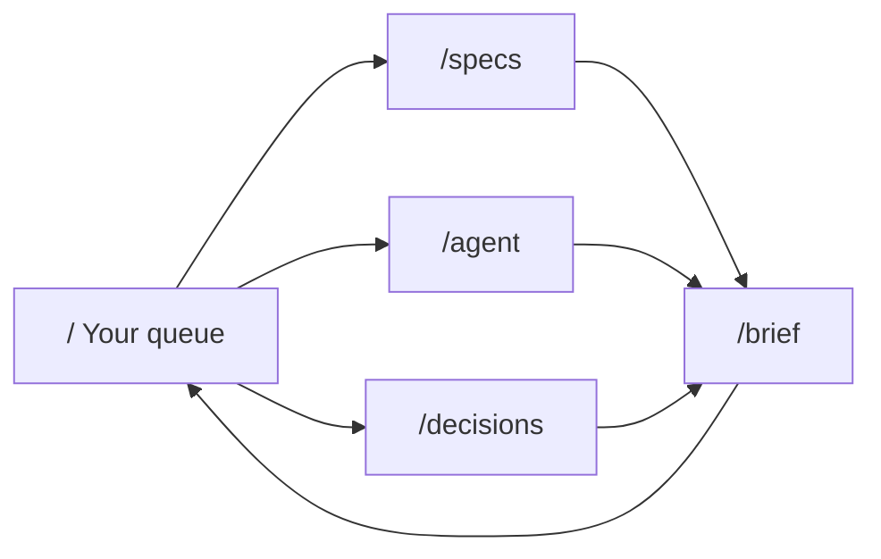

# Urtext Console 分页与页面拆分方案

- 文件路径：`docs/plans/urtext-20260725-console-pagination.md`
- 性质：决策完备的修订方案（planning only），落地前须过 plan-approval gate
- 本版依据 `codex_gpt/gpt-5.6-sol` 的 6 条 HIGH/MEDIUM 反对意见整体重写，并接受第二轮 MEDIUM 反对意见（`?page=%32` 语义）；全部反对意见按接受处理，不再申辩
- 前置：`docs/plans/urtext-20260724-ui-redesign.md`（token/安全/验收基建仍有效）、根 `DESIGN.md`（UX 权威）

---

## 1. 问题陈述与直接观测证据

**用户验收反馈**：console 把互不相关的内容类型堆在一页；每类内容没有独立分页。

| 事实 | 证据 |
|---|---|
| `/` 一页渲染 6 个内容块：summary → unmapped 横幅 → Your queue → audit 表单 → Agent lane → All Specs → Decided | `src/ui/render-console.ts:174-186` |
| 全部列表全量渲染，无 slice/limit | `yourQueueSection`(:82)、`agentLaneSection`(:104)、`allSpecsSection`(:139)、`decidedSection`(:159) 均 `.map().join('')` |
| unmapped 横幅对每个 hunk 输出三行命令模板，且同一批 hunk 又作为 human queue 首部行重复出现 | `render-console.ts:33-46` 与 `src/status.ts:162-174` |
| 唯一"减负"手段是 `<details>` 折叠 Agent lane，DOM 仍全量输出 | `render-console.ts:112`，`open` 仅由 `human.length === 0` 决定 |
| `auditControls()` 在 `auditable === 0` 时返回空串——与 `DESIGN.md:68`「audit-run form stays visible regardless」冲突 | `render-console.ts:91-94` |
| 渲染配置只有两个 diff 阈值，无页大小 | `src/ui/contracts.ts:8-42` |
| GET 侧只解析 `/?audit=`、`/brief?spec=&clause=` | `src/ui-server.ts:167`、`:173`、`:182` |
| 路由分类 8 类，每请求恰一条账本记录，字段集固定 6 个 | `ui-server.ts:41`、`:82-90`、`:294-320`、`tests/ui-acceptance-server.test.ts:311` |
| 公共根导出被逐项冻结，含 `renderConsolePage`、`readUiRenderConfig`、`UiRenderConfig` | `src/index.ts:120-123`、`tests/package-surface.test.ts:13-84` |
| 数据顺序已是确定性全序 | `src/gate.ts:72`（`ORDER BY c.spec_path, c.seq`）、`status.ts:176-181` |
| C019 oracle 直接断言 console HTML 含 `id="all-specs"` 与两条 `data-clause` | `tests/spec-impact-interactions.test.ts:49-58` |
| 浏览器页名与对比度 manifest `page` 枚举均硬编码为 `console/brief/error` | `scripts/ui-browser-check.ts:880-882`、`tests/ui-component-contrast.test.ts:66,126` |

**结论**：这是 IA 缺陷，不是渲染细节。修复必须拆页并对每类内容独立分页，同时**公共 npm API 一个符号都不动**——新页面是 HTTP 路由，不是包 API。

---

## 2. 最终 IA 与路由表

四路由方案：每页恰好一个 `?page=N`，URL 有唯一含义。`/brief` 不变。

| 方法 | 路径 | 页名（浏览器矩阵） | pathClass | 接受的查询参数 | 主内容 |
|---|---|---|---|---|---|
| GET | `/` | `console` | `console`（不变） | `page` | Your queue（human 车道，含 unmapped 行） |
| GET | `/agent` | `agent` | `agent`（新） | `page`、`audit` | Agent lane + audit 运行控件 |
| GET | `/specs` | `specs`、`specs-page-2` | `specs`（新） | `page` | All Specs（全部 live clause） |
| GET | `/decisions` | `decisions` | `decisions`（新） | `page` | Decided manual clauses at HEAD |
| GET | `/brief` | `brief` | `brief`（不变） | `spec`、`clause` | 不变 |
| GET | `/api/brief` | — | `brief-api`（不变） | `spec`、`clause` | 不变 |
| POST | `/api/{decide,review,explain,audit-run}` | — | 不变 | — | 不变（无新写路由） |

未列出的查询参数一律忽略且不影响渲染；`/?audit=` 被删除后即属此类（不报错、不显示旧通知）。



---

## 3. 逐路由内容归属（规范性，越界即缺陷）

共享外壳：skip link → `<header>`（title/HEAD 短 sha/dirty chip/Ctrl-C）→ `<nav aria-label="页面导航">` → `<main id="main">`。

| 元素 | `/` | `/agent` | `/specs` | `/decisions` |
|---|---|---|---|---|
| summary strip（counts + `data-banner="wip"`） | ✅ 唯一 | ✖ | ✖ | ✖ |
| unmapped 紧凑提示（`role="alert"`，`data-banner="unmapped"｜"unmapped-error"`） | ✅ | ✅ | ✅ | ✅ |
| 逐 hunk map/ack/spec-write-back 命令模板 | ✅ 唯一（在分页后的 queue 行内） | ✖ | ✖ | ✖ |
| 主列表区域（每页恰一个） | Your queue | Agent lane | All Specs | Decided |
| audit 运行表单 `#audit-runner` + `#audit-progress` | ✖ | ✅ 唯一（恒渲染） | ✖ | ✖ |
| audit 结果通知 `#audit-result` | ✖（服务器从不传 `auditResult`） | ✅ 唯一 | ✖ | ✖ |
| 去重 `next` 提示列表 | ✖ | ✅（仅本页行去重） | ✖ | ✖ |
| 分页 nav `nav[aria-label="分页"]` | 条件（`pageCount>1`） | 条件 | 条件 | 条件 |
| CSRF `<meta>` + `CONSOLE_SCRIPT` | ✅ | ✅ | ✖ | ✖ |

**规范性措辞（取代旧 §13.1 的"各自恰有一个主表格"）**：

> 每个 console-family 页面恰有一个**主列表区域**。该区域非空时恰含一个 `<table>`；空态不渲染 `<table>`，只渲染既有空态文案。`/` 空态文案 `nothing — prerequisites pending or all clear`、`/agent` 的 `empty`、`/decisions` 的 `none yet` 仍渲染在表体内（沿用 `queueTable`/`decidedSection` 的既有空行契约，这两页因此始终有一个表格）；`/specs` 空态渲染表外 `<p>no live clauses</p>`，不渲染表格。

- Agent lane 不再是 `<details>`：它自己就是一页。`data-section="agent-lane"` 随折叠规则一并删除（无残留属性、无别名）；`#agent-lane-title` 从 `<summary>` id 变为 `<h2>` id，标识符保留。
- `/specs`、`/decisions` 是纯读页：`pageShell` 的 `csrfToken` / `script` 均不传（二者本就可选，`src/ui/html.ts:16-21`）。
- `/brief` 内容不变，仅把 `查看全部 Specs` 的 href 从 `/#all-specs` 改为 `/specs`（`render-brief.ts:125`、`:169`），文案逐字保留。

---

## 4. 分页数据契约

### 4.1 查询语义（全部 200 / `stage:'handler'`）

`page` 是只读导航参数，不是领域输入。**没有任何一种 `page` 取值会产生 400 或 404，也不新增任何 ledger stage。**

查询串在进入 `resolvePage` 之前已由 `URLSearchParams` 完成百分号解码，因此**合法性判定作用于解码后的字符串**。

| 输入 | 行为 |
|---|---|
| 缺省 `page` | 第 1 页 |
| `page=`（空串） | 第 1 页 |
| `page=0` / `-1` / `01` / `1.5` / `+1` / `abc` / `1e3` | 第 1 页 |
| `page=%32` | `URLSearchParams` 将 `%32` 解码为 `"2"`，因此它是**合法**输入，等价于 `?page=2`，解析为第 2 页（仅当 `pageCount < 2` 时按下方越界规则收敛到最后一个有效页）。百分号编码的规范数字一律按解码结果处理 |
| 重复 `?page=1&page=2` | 第 1 页（确定性：与"缺省"同解，不取首值也不取末值） |
| 合法正整数且 `≤ pageCount` | 该页 |
| 合法正整数且 `> pageCount`（含数据缩减后的旧书签、超长数字串） | 收敛到**最后一个有效页** |

补充：不做 301/302 规范化；规范化只作用于**我们生成的链接**——生成的 href 只含规范正整数，第 1 页省略 `?page=`。服务器保持无重定向，账本因此保持一请求一记录。

### 4.2 页大小：包内配置，公共 API 冻结

- 公共 `UiRenderConfig` / `readUiRenderConfig` / `DEFAULT_UI_RENDER_CONFIG` **保持现有 diff 两字段不变**，不加 `pageSize`，不改签名。已安装的 TypeScript 消费者无需任何修改。
- 页大小是服务器/UI 的内部配置：默认 `20`，环境变量 `URTEXT_UI_PAGE_SIZE`，由包内 `src/ui/pagination.ts` 的 `readPageSize(env)` 校验（非正整数即启动抛错，fail-fast，无静默 clamp）。
- 校验复用 `contracts.ts` 既有 `parsePositiveInt`：把该函数从 module-private 改为 module-`export`（**不加入 `src/index.ts` barrel**，因此包表面零变化），供 `pagination.ts` 导入，避免第二套校验约定。
- `startUiServerWithDeps` 的**内部** `InternalOpts` 增加 `pageSize?: number`；实现为 `opts.pageSize ?? readPageSize(process.env)`。`startUiServer` 的公开 options 类型 `{ port?, open?, decider }` 逐字不变（`ui-server.ts:343-347`），`tests/ui-server.test.ts:491` 的双向可赋值断言继续成立。
- 渲染器不读环境，只接受数值参数。不提供 `?size=` 查询覆盖（见 §12）。

### 4.3 页数学与稳定顺序

```
pageCount = total === 0 ? 1 : ceil(total / pageSize)
page      = min(max(requested, 1), pageCount)      // 越界收敛到最后一页
start     = (page - 1) * pageSize
end       = min(start + pageSize, total)
```

`requested` 为 `Infinity`（超长数字串）时同样被 `min` 收敛到 `pageCount`，因此**不需要任何位数上限**。

| 路由 | 集合 | 顺序来源（渲染器只过滤与切片，禁止重排序） |
|---|---|---|
| `/` | `snapshot.status.items.filter(lane==='human')` | `status.ts:176-179`：unmapped 优先，其后 risk→key |
| `/agent` | `snapshot.status.items.filter(lane==='agent')` | `status.ts:180`：risk→key |
| `/specs` | `snapshot.clauses` | `gate.ts:72` `ORDER BY c.spec_path, c.seq` |
| `/decisions` | `snapshot.clauses.filter(decisionVerdict==='pass'||'fail')` | 同上（保序过滤） |

空集合：`total=0 → pageCount=1 → page=1`，渲染既有空态文案，且**不渲染分页 nav**。

### 4.4 All Specs：一页一个表格，spec 分组降为行组

因为全局顺序是 `spec_path, seq`，同一 spec 的条款天然连续，切片后再分组良定义（一页最多跨若干**相邻**分组）。为满足"非空恰一个表格"，分组从"每组一个 `<table>` + `<h3>`"改为**单表内的 `<tbody>` 行组**：

```html
<section id="all-specs" aria-labelledby="all-specs-title">
  <h2 id="all-specs-title">All Specs (44)</h2>
  <table><caption>All Specs (共 44 条 · 第 2/3 页)</caption>
    <thead><tr><th scope="col">Clause</th><th scope="col">Risk</th><th scope="col">Evidence</th></tr></thead>
    <tbody data-spec="specs/x/spec.md">
      <tr><th colspan="3" scope="rowgroup"><code>specs/x/spec.md</code> (本页 2)</th></tr>
      <tr data-clause="specs/x/spec.md#C001">…</tr>
      <tr data-clause="specs/x/spec.md#C002">…</tr>
    </tbody>
  </table>
</section>
```

- `(本页 n)` 是**本页该组行数**，不是该 spec 总数（分页后"分组计数"否则变成假话）。
- 动态 ID `spec-group-{index}-title` 与每组 `<h3>` 一并删除（无别名），标题层级收敛为 h1/h2；DESIGN §5 同步。
- 行契约 `data-clause="{spec}#{id}"` 与 `id="all-specs"` 逐字保留（C019 oracle 依赖）。
- 空态：`<section id="all-specs" …><h2 …>All Specs (0)</h2><p>no live clauses</p></section>`，无 `<table>`。

### 4.5 跨请求一致性（明示取舍）

分页不做快照隔离：ledger 是 append-only，行序稳定，但插入可能让某行跨页移动一位。单人 loopback 操作台接受该行为；不引入游标/快照 token（YAGNI）。越界收敛到最后一页后，"删空最后一页再刷新"不再产生任何错误页，`CONSOLE_SCRIPT` 的 `location.reload()` 因此**保持不变**。

---

## 5. 外壳、导航、unmapped、audit

### 5.1 应用导航

```html
<nav aria-label="页面导航"><a href="/">Your queue</a> · <a href="/agent" aria-current="page">Agent lane</a> · <a href="/specs">All Specs</a> · <a href="/decisions">Decided</a> · <a href="/agent?page=3">刷新状态</a></nav>
```

- 当前路由链接带 `aria-current="page"`，其余不带。
- `刷新状态` 指向当前路由的规范自链接 `pageHref(ROUTE_PATH[route], w.page)`；第 1 页省略 `?page=`。它与激活链接在第 1 页重合是有意的：激活项表达"你在哪"，刷新项表达"重新取数"，且 `刷新状态` 文案得以逐字保留。
- 页面 nav 的 `aria-label` 保持 `页面导航`；分页 nav 用 `分页`，可靠区分。
- **`audit` 通知不参与任何链接**：分页链接、刷新链接、应用 nav 一律不携带 `audit=`。理由：该通知是一次性的 post-action 结果，队列已变化后重放会撒谎。它只由 `CONSOLE_SCRIPT` 在 audit 成功时写进一次 `/agent?audit=…`，随后任何导航都丢弃它。服务器只在 `pathClass === 'agent'` 时读取 `audit`。

### 5.2 分页导航标记（规范性）

```html
<nav aria-label="分页"><a rel="prev" href="/specs">← 上一页</a> <span>第 2 / 共 3 页（共 44 条）</span> <a rel="next" href="/specs?page=3">下一页 →</a></nav>
```

- `pageCount === 1` → 整体不渲染。
- 端点降级为 `<span data-tone="muted" aria-disabled="true">← 上一页</span>`，沿用 `/brief` 既有 prev/next 约定与既有 `muted/bg` 对比度消费者（`render-brief.ts:124`）。
- **不做页码数字列表**。决策阶梯：prev/next + `第 X / 共 Y 页（共 N 条）` 已能到达任意页；数字窗口要额外引入 `.pages` CSS、省略号逻辑、窄屏隐藏规则、幽灵焦点断言和新对比度消费者，对默认 20/页、单人操作台的收益为零。因此 §6 的"窄屏 `.pages{display:none}`"整条撤销——没有要隐藏的东西，`theme.ts` 也不需要新增布局规则。升级触发条件写入实施注记：若真实仓库出现 `pageCount > 10` 的常态，再评估数字跳转。
- 所有 href 由字面量路径（`ROUTE_PATH` 常量）+ 已收敛整数拼装；`page` 从不进入 SQL、文件路径或命令模板。

### 5.3 unmapped：队列顶部只报警，修复动作在行内

完整横幅（逐 hunk `<ul>` + 三行命令）**整体删除**。

- 紧凑提示（四页都渲染，`/` 也是紧凑版）：
  - `<p role="alert" data-banner="unmapped">⚠ {n} 个未归属变更（工作区级，git diff HEAD，未跟踪文件不在检测范围）— 详见下方 Your queue 行</p>`（`/` 之外的三页，尾部改为 `<a href="/">在 Your queue 处理</a>`）
  - `<p role="alert" data-banner="unmapped-error">⚠ unmapped 检测失败：{esc(err)} — 本页不能证明不存在未归属变更</p>`（同样在 `/` 之外附 `<a href="/">在 Your queue 查看</a>`）
- 逐 hunk 修复动作迁入**分页后的 queue 行**动作列（取代 `<small>map / ack / spec write-back via CLI</small>`），命令模板逐字沿用旧横幅：
  ```html
  <small>映射：<code>urtext map &lt;spec&gt;#&lt;clause&gt; {range}</code><br>确认例外：<code>urtext ack {range} &lt;reason&gt;</code><br>或先修改对应 spec，再刷新状态。</small>
  ```
  `{range}` = `esc(item.key)` = `{filePath}:{lineStart}-{lineEnd}`（`status.ts:163`），行首列已展示同一 range。
- 因此：100 个 hunk 不再在表格之前输出 100 组命令；同一 hunk 只出现在一处（queue 行），紧凑提示只给计数与去向。
- 语义不变：workspace 级、`git diff HEAD`、未跟踪文件不在范围；**检测失败与空结果永远可区分**（D2）——`unmappedError !== null` 与 `unmapped.length === 0` 是两个互斥分支，各有独立 `data-banner`。
- `#workspace-alert-title`（原 `<h2>`）随 `<section>` 横幅一起删除，DESIGN §5 同步。

### 5.4 audit 控件：恒在，零项禁用

删除 `auditable === 0 → return ''` 的条件隐藏分支。`#audit-runner` 在 `/agent` 上**始终**渲染：

```html
<form id="audit-runner"><label>Audit 0 evidence item(s) with <select name="auditor">…</select></label>
<input name="model" placeholder="model（可选）"><input name="profile" placeholder="profile（Codex/Traex/OMP）">
<button type="submit" disabled>Run audit</button> <output id="audit-progress" aria-live="polite"></output>
<p>当前没有待审计的证据</p><small>D3 preset separation remains your responsibility.</small></form>
```

- `auditable > 0`：markup 与今天逐字一致，`<button type="submit">` 不带 `disabled`，无空态 `<p>`。
- `auditable` 由 `snapshot.status.items` **全量**计算（不是本页切片）——它是集合级事实。
- 禁用态需要真实 token 对：`theme.ts` 增加一条 `button[disabled]{color:var(--muted);background:var(--bg);border:1px solid var(--border)}`，并在对比度 manifest 注册 `button[disabled] → {fg:muted, bg:bg}`（light 5.2:1、dark 7.0:1，均 ≥4.5）。这同时让 `/brief` 的 `#explain-btn` 在运行时禁用后有确定样式。
- 不新增 `data-state` 词汇（空态用纯 `<p>`，由渲染器测试按文本断言）。

---

## 6. 响应式与可访问性

- 断点仍为 720px，不新增断点，**不新增任何隐藏规则**：分页控件在任何宽度都渲染、可 Tab、可 Enter 激活。DESIGN §10「不可隐藏事实清单」（风险徽章、证据状态、unmapped 提示、守卫按钮、错误文案）在四页上一个不许隐藏，并追加一句"分页控件同样不得隐藏"。
- 每页恰一个 `<h1>`（`urtext console`）；主标题为 `<h2>`（`Your queue` / `Agent lane` / `All Specs` / `Decided manual clauses at HEAD`）；`/specs` 不再有 `<h3>`，无跳级。
- 表格保持 `<caption>` + `<th scope="col">`；分页后 `<caption>` 为 `{名称} (共 N 条 · 第 X/Y 页)`；`/specs` 行组首行为 `<th colspan="3" scope="rowgroup">`。
- 分页 nav 内全部为原生链接与 `<span aria-disabled="true">`，无脚本参与。
- 一页最多两个 `aria-current="page"`（应用 nav 1 个 + 分页 nav 0 个——因为不做数字页码，实际恒为 1 个）。
- decide 表单的 `decision-note-{i}` / `decision-form-{i}` 中 `i` 为**页内 0 基序号**，页内唯一即满足契约。

---

## 7. 模块边界与精确私有符号

**边界不变**：领域真相仍在 `buildStatus`/`adjudicate`/`buildBrief`/`detectUnmapped`；`buildUiSnapshot` 一次产出全量快照；**分页只是渲染器/服务器投影**，不新增模型、不新增 SQL、不新增 LIMIT/OFFSET。

### 7.1 唯一新增源文件：`src/ui/pagination.ts`（纯函数，零领域依赖）

```ts
export const DEFAULT_PAGE_SIZE = 20
export const PAGE_SIZE_ENV = 'URTEXT_UI_PAGE_SIZE'
export interface PageWindow { page: number; pageCount: number; total: number; start: number; end: number }

export const readPageSize: (env: NodeJS.ProcessEnv) => number          // 未设 → 20；非正整数 → 抛错
export const resolvePage: (search: URLSearchParams) => number          // 缺省/空/非法/重复 → 1
export const pageWindow: (total: number, requested: number, pageSize: number) => PageWindow
export const pageHref: (basePath: string, page: number) => string      // page===1 → basePath
export const paginationNav: (basePath: string, w: PageWindow) => string // pageCount===1 → ''
```

```ts
const PAGE_PATTERN = /^[1-9][0-9]*$/
// 入参是 URLSearchParams：值已完成百分号解码，故 `?page=%32` 在此处即字符串 "2"，命中 PAGE_PATTERN → 2。
export const resolvePage = (search: URLSearchParams): number => {
  const values = search.getAll('page')
  if (values.length !== 1) return 1                 // 缺省或重复 → 确定性第 1 页
  const raw = values[0]!
  return PAGE_PATTERN.test(raw) ? Number(raw) : 1   // 超长数字串 → Infinity，由 pageWindow 收敛
}
```

不提供 `slicePage`：切片只有一个调用点（`renderConsoleFamilyPage`），`items.slice(w.start, w.end)` 就是全部实现。

### 7.2 `src/ui/render-console.ts`：一个包内 route-discriminated 渲染器

```ts
// —— 包内导出（不进入 src/index.ts barrel）——
export type ConsoleRoute = 'queue' | 'agent' | 'specs' | 'decisions'
export interface ConsolePageInput {
  route: ConsoleRoute
  snapshot: UiSnapshot
  csrfToken: string
  page: number          // resolvePage 的结果（已是 ≥1 整数）
  pageSize: number      // readPageSize / InternalOpts 的结果
  auditResult?: string
}
export const renderConsoleFamilyPage: (input: ConsolePageInput) => string

// —— 公共 API：签名逐字冻结，`/` 的 wrapper ——
export const renderConsolePage = (snapshot: UiSnapshot, csrfToken: string, auditResult?: string): string =>
  renderConsoleFamilyPage({ route: 'queue', snapshot, csrfToken, page: 1, pageSize: DEFAULT_PAGE_SIZE, auditResult })
```

`auditResult` 在渲染器里对所有 route 统一渲染为 `<p id="audit-result">`，因此公共 wrapper 的第三参不是死参数；产品层面它只在 `/agent` 出现，因为**服务器只在 `/agent` 传值**（§8）。

私有 helper（全部 module-private，`const` 箭头函数，沿用现有风格）：

| 符号 | 签名 | 说明 |
|---|---|---|
| `ROUTE_PATH` | `Record<ConsoleRoute, string>` | `queue:'/' agent:'/agent' specs:'/specs' decisions:'/decisions'` |
| `ROUTE_TITLE` | `Record<ConsoleRoute, string>` | `Your queue` / `Agent lane` / `All Specs` / `Decided manual clauses at HEAD` |
| `dirtyChip` | `(dirty: boolean) => string` | 不变 |
| `header` | `(s: UiSnapshot) => string` | 不变 |
| `appNav` | `(route: ConsoleRoute, page: number) => string` | 五链接 + `aria-current` + 规范自链接 |
| `summary` | `(s: UiSnapshot) => string` | 不变，仅 `/` 渲染 |
| `workspaceAlert` | `(s: UiSnapshot, route: ConsoleRoute) => string` | 紧凑 `role="alert"` 三态（clean/hunks/error） |
| `caption` | `(route: ConsoleRoute, w: PageWindow) => string` | `{名称} (共 N 条 · 第 X/Y 页)` |
| `queueRow` | `(item: StatusItem, decideForm: boolean, index: number) => string` | 增 `data-row="{key}"`；unmapped 分支改为逐字命令模板 |
| `queueTable` | `(id: string, caption: string, rows: string, emptyText: string) => string` | 不变 |
| `queueSection` | `(items: readonly StatusItem[], w: PageWindow) => string` | `/` 主区域（`decideForm=true`） |
| `auditControls` | `(items: readonly StatusItem[]) => string` | 恒渲染，零项禁用 |
| `agentSection` | `(pageItems: readonly StatusItem[], all: readonly StatusItem[], w: PageWindow) => string` | audit 表单 + 本页 `next` 去重列表 + 表格 |
| `evidenceCell` | `(c: UiClause) => string` | 不变 |
| `clauseRow` | `(c: UiClause) => string` | 不变（保留 `data-clause`） |
| `specsSection` | `(pageClauses: readonly UiClause[], w: PageWindow) => string` | 单表 + `<tbody data-spec>` 行组；空态表外 `<p>` |
| `decidedRow` | `(c: UiClause) => string` | 增 `data-row="{spec}#{clause}"` |
| `decidedSection` | `(pageClauses: readonly UiClause[], w: PageWindow) => string` | 单表，空态行 `none yet` |
| `humanItems` / `agentItems` / `decidedClauses` | `(s: UiSnapshot) => readonly …[]` | 三个保序过滤器 |

组装（唯一新增控制流）：

```ts
export const renderConsoleFamilyPage = (input: ConsolePageInput): string => {
  const { route, snapshot } = input
  const interactive = route === 'queue' || route === 'agent'
  const win = (total: number) => pageWindow(total, input.page, input.pageSize)
  let w: PageWindow, body: string
  if (route === 'queue')      { const it = humanItems(snapshot);     w = win(it.length); body = queueSection(it.slice(w.start, w.end), w) }
  else if (route === 'agent') { const it = agentItems(snapshot);     w = win(it.length); body = agentSection(it.slice(w.start, w.end), snapshot.status.items, w) }
  else if (route === 'specs') { const cs = snapshot.clauses;         w = win(cs.length); body = specsSection(cs.slice(w.start, w.end), w) }
  else                        { const cs = decidedClauses(snapshot); w = win(cs.length); body = decidedSection(cs.slice(w.start, w.end), w) }
  const notice = input.auditResult !== undefined ? `<p id="audit-result">${esc(input.auditResult)}</p>` : ''
  const main = `<main id="main">${route === 'queue' ? summary(snapshot) : ''}${workspaceAlert(snapshot, route)}${notice}${body}${paginationNav(ROUTE_PATH[route], w)}</main>`
  return pageShell({
    title: 'urtext console',
    csrfToken: interactive ? input.csrfToken : undefined,
    header: header(snapshot),
    nav: appNav(route, w.page),
    main,
    script: interactive ? CONSOLE_SCRIPT : undefined,
  })
}
```

**不新增**：`console-shell.ts`、`render-agent.ts`、`render-specs.ts`、`render-decisions.ts`、任何公共 route input 类型、任何依赖、客户端路由、客户端状态、参与分页的 `<script>`。

### 7.3 `src/ui/console-script.ts`

**不拆分**：单个 `CONSOLE_SCRIPT` 继续同时承载 decide 委托与 audit 提交，`document.getElementById('audit-runner')?.addEventListener` 的可选链在 `/` 上自然空转（`console-script.ts:41`）。唯一改动一处：

```diff
-    location.href = '/?audit=' + encodeURIComponent(j.message)
+    location.href = '/agent?audit=' + encodeURIComponent(j.message)
```

decide 成功后的 `location.reload()` **保持不变**（越界已收敛到最后一页，不存在 404 窗口）。

### 7.4 `src/ui-server.ts`

```ts
type PathClass = 'console' | 'agent' | 'specs' | 'decisions' | 'brief' | 'brief-api' | 'decide' | 'review' | 'explain' | 'audit-run' | 'missing'
// Stage 联合不变——page 不产生新的状态码决定点

const CONSOLE_ROUTE: Partial<Record<PathClass, ConsoleRoute>> = {
  console: 'queue', agent: 'agent', specs: 'specs', decisions: 'decisions',
}

// pathClassOf 新增三行：
if (method === 'GET' && pathname === '/agent') return 'agent'
if (method === 'GET' && pathname === '/specs') return 'specs'
if (method === 'GET' && pathname === '/decisions') return 'decisions'

// dispatchGet 首个分支（取代原 console 分支）：
const route = CONSOLE_ROUTE[pathClass]
if (route !== undefined) {
  scanWorkspace(ctx.db, ctx.root)
  html(200, renderConsoleFamilyPage({
    route,
    snapshot: buildUiSnapshot(ctx.db, ctx.root),
    csrfToken: ctx.csrfToken,
    page: resolvePage(url.searchParams),
    pageSize: ctx.pageSize,
    auditResult: route === 'agent' ? (url.searchParams.get('audit') ?? undefined) : undefined,
  }))
  return { status: 200, stage: 'handler' }
}
```

`Ctx` 增 `pageSize: number`；`InternalOpts` 增 `pageSize?: number`；构造处 `const pageSize = opts.pageSize ?? readPageSize(process.env)`。`scan → snapshot` 时序、loopback bind、Host 校验位置、领域调用、公共 `startUiServer` 签名全部不变。

---

## 8. 安全与请求账本

- 三个新路由都是 GET，落在 `pathClassOf` → 分派前 Host 校验路径（`ui-server.ts:281-288`），敌意 Host 一律 403 `stage:'host'`。
- POST 面**零变化**：Origin、CSRF、精确 `application/json`、4096 字节上限、四个写端点一律不动，无新写路由。
- 每请求恰一条 `AcceptanceRequestRecord`，字段集不变（`method/pathClass/status/stage/hostClass/originClass`，`tests/ui-acceptance-server.test.ts:311` 的 6 键断言原样通过），仅 `pathClass` 值域 8 → 11。新增可观测组合仅两类：`{agent|specs|decisions} × {200 handler, 403 host}`。**没有 `validation` 组合**。
- 注入面：分页链接的可变部分只有一个已收敛整数与字面量路径，仍统一过 `esc()`；`page` 从不进入 SQL、路径或命令模板。

---

## 9. 逐文件改动图

**新增（源码 1 个，测试 1 个，文档 2 个）**

| 文件 | 内容 |
|---|---|
| `src/ui/pagination.ts` | §7.1 全部符号 |
| `tests/ui-pagination.test.ts` | `resolvePage` / `pageWindow` / `pageHref` / `paginationNav` / `readPageSize` 纯函数矩阵 |
| `docs/plans/urtext-20260725-console-pagination.md` | 本文件 |
| `docs/logs/implementation-notes-console-pagination.md` | 实施期维护 |

**修改**

| 文件 | 要点 |
|---|---|
| `src/ui/contracts.ts` | 仅把 `parsePositiveInt` 改为 module-`export`（供 `pagination.ts` 复用）。`UiRenderConfig`、`DEFAULT_UI_RENDER_CONFIG`、`readUiRenderConfig` 一字不改 |
| `src/ui/render-console.ts` | §7.2：新增 route 判别渲染器与私有 helper；删除 `<details>` 折叠、完整 unmapped 横幅、`auditControls` 空串分支、`spec-group-{index}-title`/`<h3>` 分组；保留冻结的 `renderConsolePage` |
| `src/ui/console-script.ts` | 一行：audit 成功跳 `/agent?audit=` |
| `src/ui/render-brief.ts` | `:125`、`:169` 的 `/#all-specs` → `/specs` |
| `src/ui/theme.ts` | 新增一条 `button[disabled]` 规则；**不新增布局或隐藏规则** |
| `src/ui-server.ts` | §7.4：三个 pathClass、三条 `pathClassOf`、统一列表分支、`Ctx.pageSize`、`InternalOpts.pageSize`；删除 `/?audit=` 读取 |
| `src/index.ts` | **不改**（零导出增删） |
| `tests/package-surface.test.ts` | **不改**（冻结列表不扩展） |
| `tests/review-ui.test.ts` | 迁移 audit 断言：`:118-130`（`#audit-runner`/选项/`/api/audit-run`/`button.disabled = true`）与 `:132-136`（`#audit-result`）整体移入 `tests/ui-console.test.ts` 的 agent-route 用例；本文件保留 decide/runnable/CSRF-转义三例（继续用**位置参数**调用 `renderConsolePage`，充当公共签名回归） |
| `tests/ui-console.test.ts` | 扩展为四路由渲染器测试：外壳/landmarks/nav href 五链接与 `aria-current`、四路由内容归属逐格、`/specs` 单表与行组"本页 n"、`/specs` 空态无表、audit 零/非零两态、分页切片与 `nav[aria-label="分页"]`、`pageCount===1` 无分页 nav、公共 wrapper 透传 `auditResult`；删除 `<details data-section="agent-lane"` 三例与 nav 锚点断言 |
| `tests/spec-impact-interactions.test.ts` | C019 oracle：console 断言改为 `renderConsoleFamilyPage({ route:'specs', … })`，保留 `id="all-specs"` 与两条 `data-clause`；新增 `pageSize=1` 逐页遍历断言并集 == 全部 live clause 且无重复 |
| `tests/spec-impact-unmapped.test.ts` | fixture 同时构造 `unmapped:[{filePath:'<bad>.ts',lineStart:2,lineEnd:3}]` **与**对应 `status.items` 条目 `{key:'<bad>.ts:2-3', kind:'unmapped', lane:'human', primary:'unmapped', reasons:['unmapped'], next:NEXT_HINT.unmapped, filePath, lineStart, lineEnd}`；断言紧凑 `data-banner="unmapped"` 计数提示 + queue 行内 `&lt;bad&gt;.ts:2-3` 与 `urtext map`/`urtext ack` 模板；失败态断言不变 |
| `tests/ui-server.test.ts` | 四路由 200 + `pathClass` 精确值；`/specs` 敌意 Host → 403 `stage:'host'`；未知查询参数被忽略；`page` 缺省/空/`0`/`abc`/重复/越界一律 200 且与第 1 页或末页 body 一致；`/specs?page=%32` 与 `/specs?page=2` 返回逐字相同 body；**`pageSize:1` 起服务器，对四个路由逐页 GET（页数由 `第 X / 共 Y 页` 读出），用 `data-row` / `data-clause` 收集行键，断言跨页并集 == 对应完整集合、顺序一致、无重复** |
| `tests/ui-component-contrast.test.ts` + `tests/ui-contrast-manifest.json` | schema → `urtext.ui-contrast-consumers/3`；`ConsoleFixture` 增 `route`/`pageNumber`/`pageSize`（`page` 枚举仍为 `console｜brief｜error`）；`renderFixture` 的 console 分支改调 `renderConsoleFamilyPage`；`SOURCE_FILES` 增 `src/ui/pagination.ts`；重算双哈希；`REGISTERED_PAIRS`/`SELECTOR_DETECTORS` 增 `button[disabled] → {muted,bg}`；`CANONICAL_BRANCHES` 删 `console.agentLane.open|closed`，增 `console.route.{queue,agent,specs,decisions}`、`console.pagination.{single,first,middle,last}`、`console.auditRunner.{enabled,disabled}`、`console.specs.{groups,empty}`；fixture 矩阵扩为 console-quiet / console-busy / console-unmapped-error / agent-busy / agent-zero / specs-groups / specs-empty / decisions-rows / decisions-empty；按双向枚举结果增删 consumer 行 |
| `scripts/ui-browser-check.ts` | `validatePageNames` 期望页名 = `console, agent, specs, specs-page-2, decisions, brief, error`；`PAGE_AX_LINK_SELECTORS` console 去掉 `#audit-runner`、新增 agent/specs/specs-page-2/decisions 行；`PAGE_SPECIFIC_SELECTORS` 见 §10；`DISABLED_BUTTON_SELECTORS` 的 `console` 改为 `agent` |
| `tests/ui-browser-check.test.ts` | 上述三张表的单元断言同步 |
| `scripts/ui-acceptance-server.ts` | `startUiServerWithDeps(..., { …, pageSize: 2 })` |
| `tests/ui-acceptance-server.test.ts` | 断言最终记录里出现 `pathClass ∈ {agent,specs,decisions}` 且字段集仍是那 6 键 |
| `scripts/package-consumer-fixture.ts` / `tests/package-consumer.test.ts` | 已安装消费者**只经 `startUiServer` 的 HTTP 面**打 `/agent`、`/specs`、`/specs?page=2`、`/decisions`，断言 200 且含 `<html>`；不 import 任何新符号 |
| `scripts/ui-acceptance.md` | 运行手册：7 个 `--page` 参数、`pageSize=2`、删除 `--disclosure agent-lane=false` |
| `DESIGN.md` | §1/§4/§5/§10/§12/§14/§15（见 §11） |
| `docs/wiki/guides/03-command-reference.md`（:165）+ `docs/zh-CN/wiki/guides/03-command-reference.md`（:148） | `urtext ui` 段落改写为四页 + 每页独立 `?page=` + `URTEXT_UI_PAGE_SIZE`（说明其为服务器内部配置，非包 API） |
| `specs/urtext/tasks.md` | 新增 T015 |

**删除（清洁切换，不留别名/垫片）**：完整 unmapped `<section>` 横幅与 `#workspace-alert-title`、`<details data-section="agent-lane">` 及其折叠规则、`auditControls` 的 `auditable===0 → ''` 分支、`allSpecsSection` 的每组 `<table>`/`<h3>`/`spec-group-{index}-title`、`/?audit=` 处理、`/#all-specs` 锚点。

**不改**：`src/index.ts`、`tests/package-surface.test.ts`、`src/ui/html.ts`、`src/ui/brief-script.ts`、`src/brief.ts`、`src/status.ts`、`src/gate.ts`、`src/dwarf.ts`、全部 POST 处理器、`specs/urtext/spec.md`。

---

## 10. TDD 顺序与真实浏览器矩阵

**TDD 顺序（每步先红后绿，逐步 commit）**

1. `tests/ui-pagination.test.ts`
   - `resolvePage`：缺省 / `''` / `1` / `0` / `-1` / `01` / `1.5` / `+1` / `abc` / `1e3` → 1；`%32`（`URLSearchParams` 解码为 `"2"`，因此**合法**）→ 2，且与直接传 `page=2` 结果相同；重复 `page=1&page=2` / 重复同值 → 1；40 位数字串 → `Infinity`。
   - `pageWindow`：`total ∈ {0,1,19,20,21,40,41,44} × pageSize ∈ {1,20}`；断言 `Σ(end-start) === total`、切片两两不交、`requested=0/Infinity` 分别收敛到首/末页、`total=0 → pageCount=1`；另断言 `pageWindow(total=1, requested=2, pageSize=20).page === 1`（`%32` 在只有一页时收敛到最后一个有效页）。
   - `pageHref`：`page===1` 无 query；`page>1` 为 `?page=N`。
   - `paginationNav`：`pageCount===1` 返回空串；首页无 `rel="prev"` 链接而有 `aria-disabled` span；末页对称；中间页 prev+next 齐备；文案 `第 X / 共 Y 页（共 N 条）`。
   - `readPageSize`：未设 → 20；`'5'` → 5；`'0'`/`'-1'`/`'abc'`/`''` → 抛错。
2. `tests/ui-console.test.ts` 四路由渲染器（含 audit 零/非零、unmapped 紧凑提示 + 行内命令、`/specs` 单表行组与空态、`aria-current`、切片、caption、无分页 nav 条件、wrapper 透传）。
3. `tests/review-ui.test.ts` 迁移（audit 断言移出，位置参数调用保留）。
4. `tests/ui-server.test.ts` HTTP 矩阵（含 `?page=%32` ≡ `?page=2` 的 body 相等断言）+ `pageSize=1` 四路由全遍历并集证明。
5. `tests/spec-impact-interactions.test.ts` C019 oracle 迁移 + 跨页覆盖断言；`tests/spec-impact-unmapped.test.ts` fixture 修正。
6. 对比度 manifest 重建（schema/3、fixture 扩展、双哈希重算、`button[disabled]` 消费者）。
7. `scripts/ui-browser-check.ts` 三张表 + `tests/ui-browser-check.test.ts` 同步；`package-consumer` / 验收服务器同步。
8. `npm run check` + `npm test` 全绿；随后 `sh scripts/full-test.sh`。

**真实浏览器矩阵（Chrome CDP，验收 fixture 5 clauses / 1 spec，服务器 `pageSize=2` ⇒ `/specs` 恰 3 页）**
7 页名 × viewport {1440,1024,390} × scheme {light,dark} = 42 次运行：

| 页名 | URL | 分页状态 | 页面专属选择器期望 |
|---|---|---|---|
| `console` | `/` | 由 fixture 决定（不断言页数） | `#audit-runner:0`、`#explain-btn:0` |
| `agent` | `/agent` | 首页 | `#audit-runner:1`、`#explain-btn:0` |
| `specs` | `/specs` | 首页（有 next 无 prev） | `nav[aria-label="分页"]:1`、`a[rel="prev"]:0`、`a[rel="next"]:1`、`#audit-runner:0` |
| `specs-page-2` | `/specs?page=2` | 中间页 | `nav[aria-label="分页"]:1`、`a[rel="prev"]:1`、`a[rel="next"]:1` |
| `decisions` | `/decisions` | 不断言页数（避免 fixture 过拟合） | `#audit-runner:0` |
| `brief` | `/brief?spec=…&clause=C004` | 不变（5 个真实 diff） | 不变 |
| `error` | `/brief?spec=…&clause=C999` | 不变 | 不变 |

- 分页交互只在**一个代表性多页路由**（`/specs` + `/specs?page=2`）上验证；不设越界/非法页浏览器场景（它们已不存在错误语义，且纯函数与 HTTP 层已覆盖）。
- 每页每次运行仍执行既有全部断言：landmarks、单 h1 与层级、AX 名称、Tab 焦点序（skip link 第一）、无横向溢出、reduced-motion、AX 树闭合、DOM↔AX 关联、无外部请求、四个 HTTP guard case、逐 pair 计算对比度 ≥4.5。
- `--disclosure` 只保留 brief 的 blame-diff 期望；`agent-lane=false` 删除。`--diff-count 5` 仍只对 `brief` 生效。
- 禁用态检查（1440 宽）：`brief → #explain-btn`、`agent → #audit-runner button[type="submit"]`（验收 fixture 的 C005 保持 unaudited，因此该按钮初始可用，仍能验证"提交期间自动禁用"）。零项禁用态由渲染器测试 + `agent-zero` 对比度 fixture 覆盖。

---

## 11. 迁移、回滚、文档与自举

**迁移**

1. 一次性切换，无别名、无 `?legacy=`、无双栈渲染。`/#all-specs` 全仓替换为 `/specs`（仅 `render-brief.ts` 两处）。
2. `/` 仍是入口与默认首屏；audit 表单与 `?audit=` 通知整体迁到 `/agent`；`/?audit=x` 变为被忽略的未知参数（不报错、不显示旧通知）。
3. 已安装消费者零改动：根导出集合、`renderConsolePage` 签名、`UiRenderConfig`、`readUiRenderConfig`、`startUiServer` options 全部逐字不变。
4. **自举门（本仓库特有，不可跳过）**：改动落盘后为每个新增/修改的 UI 源文件执行 `urtext map specs/urtext/spec.md#C019 <file>:<start>-<end>`（确属无关的改动用 `urtext ack … <reason>`）；`urtext verify` 重跑 C019 oracle；经 `/agent` 的 Run audit 补齐 C019 证据的 audit 覆盖；工作树洁净后 `urtext brief specs/urtext/spec.md#C019` 取 hash 并 `urtext review specs/urtext/spec.md#C019 --approve --brief <hash> <note>`（risk:high，走 unsafe lane）；`urtext gate` 干净收尾。
5. **不改 `specs/urtext/spec.md`**：C019 的"必须可浏览全部 live clause"已经约束分页后的可浏览性；改条文文本会触发 `text_hash` stale 级联到 C017 依赖闭包，收益为零。规范性 UI 契约按 DESIGN §2 归属根 `DESIGN.md`。

**回滚**：纯代码回滚（无 schema、无 ledger、无迁移脚本）。回滚后 `/agent|/specs|/decisions` 变 404，仅影响临时会话的书签，无持久状态损失。

**文档**

- 根 `DESIGN.md`（与代码同 commit，§16）：
  - §1 范围改为"四个 console-family 页 + brief"。
  - §4 拆为 4.1 `/`、4.2 `/agent`、4.3 `/specs`、4.4 `/decisions`、4.5 `/brief`，写入 §3 内容归属表与"每页恰一个主列表区域"的规范措辞。
  - §5 注册表：删除 `#workspace-alert-title`、`spec-group-{index}-title`、`data-section="agent-lane"`；`#agent-lane-title` 标注为 `<h2>` id；新增 `nav[aria-label="分页"]`、`a[rel="prev"|"next"]`、`aria-current="page"`（每页恰一个，位于页面导航）、`data-row`（Your queue / Agent lane / Decided 行）、`data-spec`（All Specs 行组）；`data-clause` 保留为 All Specs 行的冻结 C019 契约。
  - §10 追加"分页控件在任何宽度都不得隐藏"，其余不可隐藏事实清单不变。
  - §12 删除 Agent lane 折叠规则；写明 audit 表单在 `/agent` 恒可见、零项时禁用。
  - §14 追加：页大小默认 20、`URTEXT_UI_PAGE_SIZE` 覆盖、非正整数即抛错，并明确它**不属于** `UiRenderConfig` 公共契约，只是服务器/UI 内部配置。
  - §15 追加：console-family 四路由的浏览器/AX 验证由 `console/agent/specs/specs-page-2/decisions` 五个页名承担。
- `docs/plans/urtext-20260724-ui-redesign.md`：**不重写历史**，仅在文首加一行带日期的状态指针：
  `> 2026-07-25：本文件 §3.1 的单页 console IA 已由 docs/plans/urtext-20260725-console-pagination.md 取代（四路由 + 每路由独立 ?page=）；token、安全、验收基建章节继续有效。`
- `docs/logs/implementation-notes-ui-redesign.md`：不修改。新决策写入 `docs/logs/implementation-notes-console-pagination.md`（含"不做数字页码"的升级触发条件、Decided 排序保持 spec 序的取舍）。
- 英中命令参考同步改写 `urtext ui` 段落。
- `specs/urtext/tasks.md` 追加：`- [ ] T015 console 分页与页面拆分 <!-- role:coder depends:T014 gate:true clauses:C019 -->`。

**清理**：删除上表"删除"清单中的全部符号与分支；`grep` 确认仓库内无 `/#all-specs`、`data-section="agent-lane"`、`workspace-alert-title`、`spec-group-` 残留。

---

## 12. 非目标 / 已知已知 / 已知未知 / 未知未知探针

**非目标（本轮明确拒绝）**：客户端过滤与搜索；排序控件；虚拟滚动与无限滚动；游标/快照分页；数字页码窗口；`?size=` 查询覆盖页大小；每路由独立页大小；把 `pageSize` 加进公共 `UiRenderConfig`；为 `page` 增加 400/404 语义或新 ledger stage；对已由 `URLSearchParams` 解码的 `page` 值做二次解码或拒绝；用 JS 隐藏区块伪装分页；分页状态持久化；框架、打包器、新依赖、守护进程、远端后端。

**已知已知**：数据顺序已是确定性全序（`gate.ts:72`、`status.ts:176-181`）；`buildUiSnapshot` 一次给出四类数据，分页不增加查询；GET Host 校验覆盖全部路由；`URLSearchParams` 在 `resolvePage` 之前完成百分号解码，故 `%32` 与 `2` 在整条链路上不可区分；对比度 manifest 因源文件字节变化强制重算，遗漏即测试失败。

**已知未知**：真实工作区 `/decisions` 的增长速率（决定 20 是否长期合适——已可由环境变量调，不猜）；操作者是否更希望 Decided 按裁决时间倒序（当前按 spec 序，本轮不改，写入实施注记）；44 clause 之外的大仓分布。

**未知未知探针（必须实际执行并留证据）**

1. `pageSize=1` 经真实 HTTP 对四个路由逐页遍历：并集 == 全量、顺序一致、无重复、无缺失。
2. 边界扫描：`total × pageSize` 组合表断言切片不交且总长守恒。
3. 100 hunk 合成快照：`/` 的紧凑提示只出现一次且只含计数；命令模板出现次数 == 本页 unmapped 行数（不是全量）。
4. `auditable === 0` 快照：`/agent` 仍含 `#audit-runner`，提交按钮带 `disabled`，空态文案可见。
5. 真实仓库跑 `urtext ui`（44 clauses / 2 specs）：`/specs` 三页行组"本页 n"求和 == 44。
6. 在最后一页删空场景手工验证：裁决末页最后一项后 `location.reload()` 得到 200 的最后有效页，不出现任何错误页。

---

## 13. 规范性验收清单（无 TBD）

**公共 API 冻结**

1. `src/index.ts` 导出集合与 `tests/package-surface.test.ts` 的冻结列表逐字未变。
2. `renderConsolePage(snapshot, csrfToken, auditResult?)` 位置参数签名未变，且 `tests/review-ui.test.ts` 仍以位置参数调用并通过。
3. `UiRenderConfig` / `readUiRenderConfig` / `DEFAULT_UI_RENDER_CONFIG` 仍只含两个 diff 字段；无必填 `pageSize`。
4. `startUiServer` 的公开 options 仍与 `{ port?: number; open?: boolean; decider: string }` 双向可赋值。
5. 已安装消费者仅通过 `startUiServer` 的 HTTP 面验证 `/agent`、`/specs`、`/specs?page=2`、`/decisions` 均 200。
6. `tests/review-ui.test.ts` 的 `#audit-runner` 与 `#audit-result` 断言已迁至 agent-route 渲染器测试且全绿。

**功能与内容归属**

7. `/`、`/agent`、`/specs`、`/decisions` 均服务端渲染 200，每页恰一个主列表区域；非空恰一个 `<table>`；`/specs` 空态无 `<table>` 且保留 `no live clauses`。
8. §3 内容归属表逐格成立；越界元素出现即缺陷。
9. 四路由各自独立 `?page=N`，互不影响；`/brief` 内容不变且 `查看全部 Specs` 指向 `/specs`。
10. `/` 顶部只有紧凑 `role="alert"` 计数/失败提示；逐 hunk 的 `urtext map` / `urtext ack` / spec write-back 文案逐字出现在对应分页 queue 行内，且不与提示重复。
11. `pageSize=1` 全遍历证明每个 unmapped hunk 恰可达一次；检测失败与空结果分别渲染 `data-banner="unmapped-error"` 与无提示，永远可区分。
12. `#audit-runner` 在 `/agent` 恒存在；零 auditable 时提交按钮 `disabled` 且渲染空态文案；非零时按钮可用。

**分页语义**

13. 缺省 / 空 / `0` / 负数 / 前导零 / 小数 / 非数字 / 重复参数 → 第 1 页，HTTP 200，`stage:'handler'`。百分号编码的规范数字不属于本条：`URLSearchParams` 解码后即普通正整数，按第 14/16 条处理。
14. 合法正整数（含 `?page=%32` 解码所得的 `2`）在 `≤ pageCount` 时解析为该页，`> pageCount` 时收敛到最后一个有效页；两者均 HTTP 200、`stage:'handler'`。`?page=%32` 与 `?page=2` 的响应 body 逐字相同。**全仓无列表页 400/404 渲染器、无 `validation` 组合、无位数上限。**
15. `total=0 → pageCount=1`，第 1 页 200 且渲染既有空态文案；`pageCount===1` 不渲染分页 nav。
16. `pageCount = max(1, ceil(total/pageSize))`；切片 `[start,end)`；四路由跨页并集 == 完整集合、顺序与 snapshot 数组序一致、无重复（`ui-server.test.ts` 以内部 `pageSize=1` 经真实 HTTP 证明）。
17. 生成链接只含规范正整数；第 1 页链接省略 `?page=`；任何生成链接都不携带 `audit=`。
18. 页大小默认 20；`URTEXT_UI_PAGE_SIZE` 非正整数即启动抛错。

**外壳与可访问性**

19. 每页：skip link 为 body 首个且首个可聚焦元素 → `<header>` → `<nav aria-label="页面导航">` → `<main id="main">`。
20. 当前路由链接带 `aria-current="page"` 且全页恰一个；`刷新状态` 指向当前路由的规范自链接。
21. 分页 nav 为 `nav[aria-label="分页"]`，含 prev / `第 X / 共 Y 页（共 N 条）` / next，端点为 `aria-disabled="true"` 的 `<span data-tone="muted">`。
22. 每页恰一个 `<h1>`，标题不跳级；所有 `aria-labelledby` 目标存在且页内唯一。
23. 所有表格保有 `<caption>` 与 `<th scope="col">`；`/specs` 行组首行为 `<th colspan="3" scope="rowgroup">`。
24. 任何宽度都不隐藏风险徽章、证据状态、unmapped 提示、守卫按钮、错误文案、分页控件；`theme.ts` 未新增任何 `display:none`。
25. `/specs`、`/decisions` 不输出 CSRF meta 与任何 `<script>`。

**安全与账本**

26. 三个新路由敌意 Host → 403 且 `stage:'host'`。
27. POST 面（Origin/CSRF/精确 JSON/4096 字节上限）与四个写端点行为逐条不变。
28. 每请求恰一条账本记录，字段集仍是 6 键；`pathClass` 新增 `agent|specs|decisions`；`Stage` 联合未新增成员。
29. 所有动态值经 `esc()`；`page` 从不进入 SQL / 路径 / 命令模板。

**证据**

30. `npm run check` 与 `npm test` 全绿；`sh scripts/full-test.sh` 通过。
31. 对比度 manifest schema 升到 `/3`，双哈希重算通过，双向消费者枚举无缺失无过期，含 `button[disabled]` 禁用态，light/dark 全 pair ≥4.5。
32. Chrome 矩阵 7 页 × 3 viewport × 2 主题全通过，0 failure，截图与 AX 快照落盘。
33. C019 oracle 在 `/specs` 上保留 `id="all-specs"` 与 `data-clause` 断言，并新增跨页覆盖全部 live clause 的证明。

**文档与自举**

34. 根 `DESIGN.md` §1/§4/§5/§10/§12/§14/§15 与代码同 commit 更新。
35. 英中命令参考 `urtext ui` 段落同步，并注明页大小是内部配置而非包 API。
36. 旧计划仅追加一行取代指针，历史实施注记未被改写。
37. `tasks.md` 新增 T015；`spec.md` 未改动。
38. 新增/修改 UI 源文件全部完成 `urtext map`（或带理由 `ack`）；`urtext verify` 通过；C019 audit 覆盖补齐；洁净工作树下完成 C019 `review --approve`；`urtext gate` 干净。
